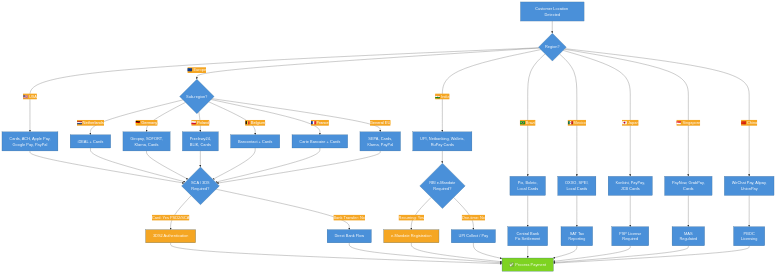
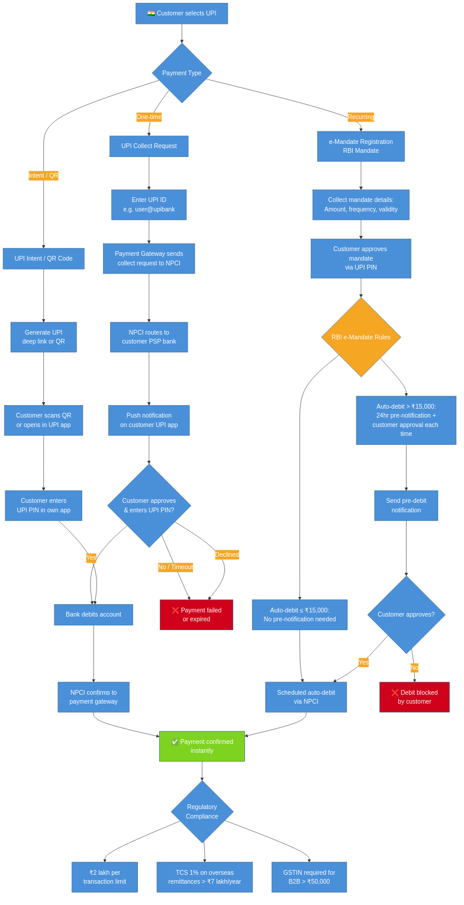
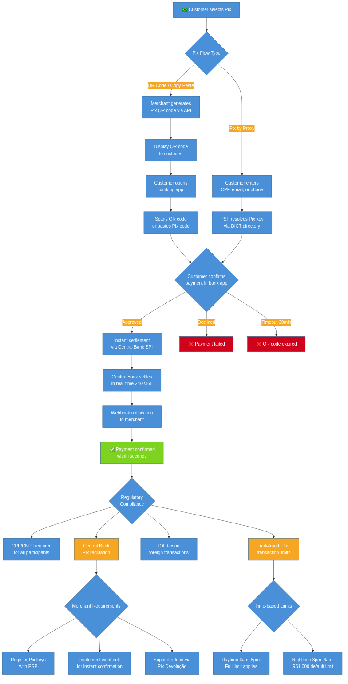
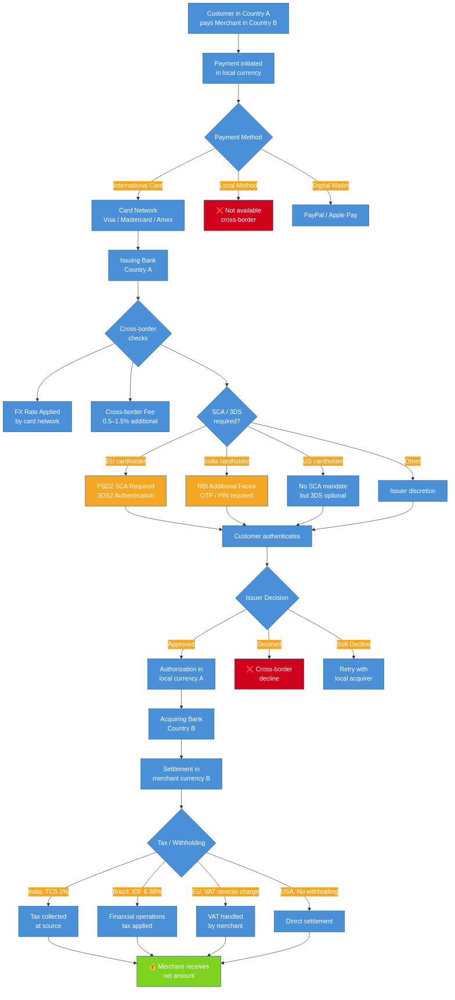

# Regional Payment Methods, Card Challenges & Regulations

## Overview

Payment processing varies dramatically by country and region. Each market has unique dominant payment methods, regulatory frameworks, card network challenges, authentication requirements, and tax implications. Understanding these differences is critical for maximizing conversion rates and maintaining compliance when selling internationally.

This document covers payment landscapes, card-specific challenges, and regulatory requirements for major markets: **USA, Europe (EU/UK), India, Brazil, Mexico, China, Japan, Singapore**, and other key regions.

## Table of Contents

1. [Regional Payment Decision Flow](#regional-payment-decision-flow)
2. [United States](#united-states)
3. [Europe (EU & UK)](#europe-eu--uk)
4. [India](#india)
5. [Brazil](#brazil)
6. [Mexico](#mexico)
7. [China](#china)
8. [Japan](#japan)
9. [Singapore & Southeast Asia](#singapore--southeast-asia)
10. [Cross-Border Payment Flow](#cross-border-payment-flow)
11. [Regional Card Challenges Summary](#regional-card-challenges-summary)
12. [Multi-Region Implementation Strategy](#multi-region-implementation-strategy)
13. [Flow Diagrams](#flow-diagrams)

---

## Regional Payment Decision Flow

When a customer initiates a payment, the optimal payment methods depend on their location. The following diagram shows the decision tree for routing customers to the right methods.



<details>
<summary>View Mermaid source</summary>

See [`diagrams/regional-payment-decision-flow.mmd`](diagrams/regional-payment-decision-flow.mmd)

</details>

---

## United States

### Payment Landscape

| Method | Market Share | Settlement | Notes |
|--------|-------------|-----------|-------|
| Credit/Debit Cards | ~65% | 2–3 days | Visa, Mastercard, Amex, Discover |
| Digital Wallets | ~15% | 1–2 days | Apple Pay, Google Pay, PayPal |
| ACH Direct Debit | ~10% | 3–5 days | Low cost, high-value B2B |
| BNPL | ~5% | 2–5 days | Klarna, Affirm, Afterpay |
| Cash (online) | <1% | N/A | Minimal for e-commerce |

### Card Challenges

- **No SCA mandate**: Unlike Europe, the US has no regulatory requirement for Strong Customer Authentication. 3DS is optional and issuer-initiated (liability shift model).
- **High interchange fees**: US interchange is among the highest globally — 1.5–3.5% depending on card type (rewards cards are most expensive). The Durbin Amendment caps debit interchange for large issuers at ~0.05% + $0.21.
- **Card-not-present fraud**: The US has high CNP fraud rates due to delayed EMV adoption and lack of SCA. Merchants bear liability unless they implement 3DS.
- **AVS (Address Verification)**: US-specific fraud prevention — matches billing address with the issuer. International cards often fail AVS checks.
- **Chargeback culture**: US consumers frequently file chargebacks. Chargeback rates above 1% risk account termination.

### Regulatory Environment

| Regulation | Impact |
|-----------|--------|
| **PCI DSS** | Required for all card-handling merchants. Use hosted forms to reduce scope (SAQ A). |
| **Durbin Amendment** | Caps debit interchange for banks with >$10B assets. Enables debit routing choice. |
| **State sales tax** | No federal sales tax. Tax nexus varies by state. Use tax engines (Avalara, TaxJar). |
| **CCPA / state privacy** | California and other states require data privacy compliance for payment data. |
| **OFAC sanctions** | Must screen against SDN (Specially Designated Nationals) list for sanctioned parties. |
| **FinCEN / BSA** | Anti-money laundering (AML) requirements for payment service providers. |

### Code Example — US-Optimized Card Payment

```csharp
public class UsCardPaymentService
{
    private readonly IStripeClient _client;

    public async Task<PaymentResult> ProcessUsCardAsync(CardPaymentRequest request)
    {
        var options = new PaymentIntentCreateOptions
        {
            Amount = ConvertToCents(request.Amount),
            Currency = "usd",
            PaymentMethod = request.PaymentMethodId,
            Confirm = true,
            // 3DS only when issuer requests it (optional in US)
            PaymentMethodOptions = new PaymentIntentPaymentMethodOptionsOptions
            {
                Card = new PaymentIntentPaymentMethodOptionsCardOptions
                {
                    RequestThreeDSecure = "automatic" // Let issuer decide
                }
            },
            Metadata = new Dictionary<string, string>
            {
                ["order_id"] = request.OrderId,
                ["avs_check"] = "enabled" // US-specific
            }
        };

        var service = new PaymentIntentService(_client);
        var intent = await service.CreateAsync(options);

        return MapToResult(intent);
    }
}
```

---

## Europe (EU & UK)

### Payment Landscape

| Method | Popularity | Key Markets | Settlement |
|--------|-----------|-------------|-----------|
| Cards (Visa, MC) | High everywhere | All EU + UK | 1–3 days |
| SEPA Direct Debit | High for recurring | Eurozone | 3–5 days |
| iDEAL | ~60% of online payments | 🇳🇱 Netherlands | Instant confirm, 1 day settle |
| Bancontact | ~50% of online payments | 🇧🇪 Belgium | Instant |
| Giropay / SOFORT | Common | 🇩🇪 Germany | 1–2 days |
| Przelewy24 (P24) | Dominant online | 🇵🇱 Poland | Instant |
| BLIK | Growing fast | 🇵🇱 Poland | Instant |
| Carte Bancaire | Dominant card network | 🇫🇷 France | 1–3 days |
| Klarna | High | 🇸🇪 🇩🇪 🇳🇱 Nordics, DACH | 2–5 days |
| Multibanco | Common | 🇵🇹 Portugal | 1–2 days |
| MB WAY | Growing | 🇵🇹 Portugal | Instant |
| Swish | Dominant mobile | 🇸🇪 Sweden | Instant |
| MobilePay | Common | 🇩🇰 Denmark | Instant |
| Twint | Common | 🇨🇭 Switzerland | Instant |
| PayPal | ~20% across EU | All EU + UK | 1–3 days |

### Card Challenges — PSD2 & SCA

The **Payment Services Directive 2 (PSD2)** and its **Strong Customer Authentication (SCA)** mandate are the most significant regulatory challenges for card payments in Europe.

| Aspect | Requirement |
|--------|------------|
| **SCA mandate** | All electronic payments must use 2 of 3 factors: knowledge (PIN/password), possession (phone/card), inherence (biometric) |
| **3DS2 required** | Card payments must go through 3D Secure 2 unless exempt |
| **Exemptions** | Low-value (<€30, max 5 consecutive), low-risk (TRA), recurring after first, merchant-initiated, trusted beneficiary |
| **Liability shift** | Shifts from merchant to issuer when 3DS is used |
| **Decline rates** | SCA can increase decline rates by 5–15% if poorly implemented |
| **Frictionless flow** | 3DS2 enables frictionless authentication for low-risk transactions via risk-based analysis |

#### SCA Exemption Strategy

```csharp
public class ScaExemptionService
{
    public PaymentIntentCreateOptions ApplyExemptions(
        PaymentIntentCreateOptions options,
        decimal amount,
        string currency,
        RiskAssessment risk)
    {
        options.PaymentMethodOptions ??= new PaymentIntentPaymentMethodOptionsOptions();
        options.PaymentMethodOptions.Card ??= new PaymentIntentPaymentMethodOptionsCardOptions();

        // Low-value exemption: transactions under €30
        if (amount < 30m && currency.Equals("eur", StringComparison.OrdinalIgnoreCase))
        {
            options.PaymentMethodOptions.Card.RequestThreeDSecure = "automatic";
            return options;
        }

        // Transaction Risk Analysis (TRA) exemption
        // PSP must maintain fraud rate below thresholds:
        // - <€100: fraud rate < 0.13%
        // - <€250: fraud rate < 0.06%
        // - <€500: fraud rate < 0.01%
        if (risk.Score < 0.1m && amount <= 500m)
        {
            options.PaymentMethodOptions.Card.RequestThreeDSecure = "automatic";
            return options;
        }

        // Default: request 3DS
        options.PaymentMethodOptions.Card.RequestThreeDSecure = "any";
        return options;
    }
}
```

### Regulatory Environment

| Regulation | Impact |
|-----------|--------|
| **PSD2 / SCA** | Mandatory 3DS2 for card payments. Exemptions available but must be managed. |
| **GDPR** | Strict data privacy. Payment data is personal data. Requires consent, right to deletion, breach notification. |
| **VAT** | EU VAT system. Cross-border B2C digital services use OSS (One-Stop Shop). Reverse charge for B2B. |
| **PCI DSS** | Same global standard applies. |
| **EU AI Act** | Affects AI-driven fraud detection systems — requires transparency in automated decision-making. |
| **Digital Markets Act** | May affect payment method choice in app stores and digital platforms. |

### Country-Specific Notes

| Country | Key Differences |
|---------|----------------|
| 🇬🇧 **UK** | Post-Brexit: UK has its own SCA rules via FCA. Similar to PSD2 but independently managed. |
| 🇫🇷 **France** | Carte Bancaire co-badged with Visa/MC. Must support CB routing for lower interchange. |
| 🇩🇪 **Germany** | High preference for bank transfers (SOFORT, Giropay). Invoice payment via Klarna popular. |
| 🇳🇱 **Netherlands** | iDEAL is near-mandatory for NL customers. 60%+ of online payments use iDEAL. |
| 🇵🇱 **Poland** | P24 and BLIK dominate. Many consumers don't have credit cards. |
| 🇸🇪 **Sweden** | Swish for mobile, Klarna for BNPL. Cards for international sites. |
| 🇨🇭 **Switzerland** | Not EU — separate regulations. Twint popular. CHF currency. |

---

## India

### Payment Landscape

| Method | Market Share | Settlement | Notes |
|--------|-------------|-----------|-------|
| UPI (Unified Payments Interface) | ~55% of digital | Instant | NPCI-managed, free for most transactions |
| Debit Cards (RuPay, Visa, MC) | ~15% | 2–3 days | RuPay has zero MDR for < ₹2,000 |
| Credit Cards | ~10% | 2–3 days | Visa, Mastercard, RuPay |
| Netbanking | ~8% | 1–2 days | Direct bank login redirect |
| Mobile Wallets | ~7% | 1–2 days | Paytm, PhonePe, Amazon Pay |
| BNPL | ~3% | Varies | ZestMoney, LazyPay, Simpl |
| EMI (Equated Monthly Installments) | ~2% | Varies | Cardless EMI and card-based EMI |

### UPI Payment Flow



<details>
<summary>View Mermaid source</summary>

See [`diagrams/india-upi-payment-flow.mmd`](diagrams/india-upi-payment-flow.mmd)

</details>

### Card Challenges — RBI Regulations

India's Reserve Bank of India (RBI) has some of the most stringent card payment regulations globally.

| Regulation | Impact |
|-----------|--------|
| **Additional Factor Authentication (AFA)** | Every card-not-present transaction requires a second factor (OTP via SMS or in-app approval). Similar to 3DS but mandatory with no exemptions. |
| **e-Mandate for recurring** | Recurring card payments require explicit e-mandate registration. Auto-debits > ₹15,000 require pre-debit notification + customer approval for each charge. |
| **Card-on-file tokenization** | Merchants cannot store raw card numbers. All card-on-file must be tokenized through card networks or payment aggregators (since Oct 2022). |
| **MDR caps** | Zero MDR on RuPay debit cards and UPI for transactions < ₹2,000. |
| **Two-factor for international** | International card transactions from India require OTP + additional verification. |

#### RBI e-Mandate Flow for Recurring Payments

```csharp
public class IndiaRecurringPaymentService
{
    public async Task<MandateResult> RegisterMandateAsync(MandateRequest request)
    {
        // Step 1: Create mandate with customer consent
        var mandate = new MandateRegistration
        {
            CustomerId = request.CustomerId,
            MaxAmount = request.MaxAmount, // e.g., ₹15,000
            Frequency = request.Frequency, // Monthly, Quarterly
            ValidUntil = request.ValidUntil,
            PaymentMethodToken = request.CardToken // Must use token, not raw PAN
        };

        // Step 2: Customer authenticates via OTP (mandatory AFA)
        var authResult = await _paymentGateway.InitiateMandateAsync(mandate);

        if (authResult.RequiresOtp)
        {
            // Customer enters OTP on bank page — redirect flow
            return new MandateResult
            {
                Status = MandateStatus.PendingAuthentication,
                RedirectUrl = authResult.OtpRedirectUrl
            };
        }

        return new MandateResult { Status = MandateStatus.Active };
    }

    public async Task<PaymentResult> ExecuteRecurringChargeAsync(
        Guid mandateId, decimal amount)
    {
        var mandate = await _mandateRepository.GetByIdAsync(mandateId);

        // RBI rule: pre-debit notification required 24 hours before charge
        if (amount > 15_000m)
        {
            // Must notify customer AND get approval for amounts > ₹15,000
            await _notificationService.SendPreDebitNotificationAsync(
                mandate.CustomerId, amount, DateTime.UtcNow.AddHours(24));

            // Wait for customer approval (webhook from bank)
            return new PaymentResult
            {
                Status = PaymentStatus.PendingCustomerApproval
            };
        }

        // For amounts ≤ ₹15,000: auto-debit permitted with pre-notification
        await _notificationService.SendPreDebitNotificationAsync(
            mandate.CustomerId, amount, DateTime.UtcNow.AddHours(24));

        return await _paymentGateway.ChargeMandateAsync(mandateId, amount);
    }
}
```

### Regulatory Environment

| Regulation | Impact |
|-----------|--------|
| **RBI Payment Aggregator License** | All online payment aggregators must be licensed by RBI (PA/PG guidelines). |
| **Data localization** | Payment data for Indian customers must be stored within India (RBI mandate since 2019). |
| **TCS on foreign remittance** | Tax Collected at Source: 5% TCS on overseas remittances above ₹7 lakh/year (20% for non-tax-filers). |
| **GST** | 18% GST on digital services. B2B transactions > ₹50,000 require GSTIN. |
| **KYC requirements** | Full KYC mandatory for wallet balances > ₹10,000 and certain payment instruments. |
| **UPI transaction limits** | ₹1 lakh per transaction (₹2 lakh for some categories like insurance, education). |

### Key Payment Providers

| Provider | Strengths | Notes |
|----------|----------|-------|
| **Razorpay** | Full-stack: UPI, cards, netbanking, EMI, mandates | Most popular in India |
| **Cashfree** | Strong UPI, payouts, verification APIs | Growing fast |
| **PayU India** | Long track record, wide bank coverage | Enterprise-focused |
| **Stripe India** | International merchants expanding to India | Limited local methods vs. Razorpay |
| **Juspay** | Payment orchestration, UPI optimizations | Powers many large merchants |

---

## Brazil

### Payment Landscape

| Method | Market Share | Settlement | Notes |
|--------|-------------|-----------|-------|
| Pix | ~40% of digital | Instant (24/7) | Central Bank system, near-zero cost |
| Credit Cards | ~30% | 2–30 days | Installments (parcelamento) dominate |
| Boleto Bancário | ~15% | 1–3 days | Bank-generated voucher, cash-friendly |
| Debit Cards | ~10% | 1–2 days | Elo, Visa, Mastercard |
| Digital Wallets | ~5% | 1–2 days | PicPay, Mercado Pago |

### Pix Payment Flow



<details>
<summary>View Mermaid source</summary>

See [`diagrams/brazil-pix-payment-flow.mmd`](diagrams/brazil-pix-payment-flow.mmd)

</details>

### Card Challenges — Installments (Parcelamento)

Installment payments are a fundamental part of Brazilian e-commerce. ~70% of credit card transactions are paid in installments. There are two types:

| Type | Who Pays Interest | Use Case |
|------|------------------|----------|
| **Parcelado sem juros** (interest-free) | Merchant absorbs cost | Most common — merchant pays MDR + installment fee |
| **Parcelado com juros** (with interest) | Customer pays interest | Less common — higher conversion for expensive items |

```csharp
public class BrazilInstallmentService
{
    public InstallmentOptions CalculateInstallments(
        decimal totalAmount, string cardBrand, int maxInstallments = 12)
    {
        var options = new List<InstallmentOption>();

        for (int i = 1; i <= maxInstallments; i++)
        {
            decimal installmentAmount = totalAmount / i;

            // Minimum installment amount (typically R$5 or R$10)
            if (installmentAmount < 5m) break;

            // Interest-free installments: merchant absorbs the fee
            // Typical merchant fee: 1–3% per installment beyond 1
            decimal merchantFee = i > 1
                ? totalAmount * (0.0199m * (i - 1)) // ~1.99% per installment
                : 0m;

            options.Add(new InstallmentOption
            {
                NumberOfInstallments = i,
                InstallmentAmount = installmentAmount,
                TotalAmount = totalAmount,
                InterestFree = true,
                MerchantFee = merchantFee
            });
        }

        return new InstallmentOptions { Options = options };
    }
}

public record InstallmentOption
{
    public int NumberOfInstallments { get; init; }
    public decimal InstallmentAmount { get; init; }
    public decimal TotalAmount { get; init; }
    public bool InterestFree { get; init; }
    public decimal MerchantFee { get; init; }
}
```

### Regulatory Environment

| Regulation | Impact |
|-----------|--------|
| **Central Bank Pix regulation** | All PSPs must support Pix. Real-time settlement 24/7/365. Nighttime transaction limits for fraud prevention. |
| **CPF/CNPJ required** | Every Brazilian in a financial transaction must provide their CPF (individuals) or CNPJ (businesses). Required for Boleto and Pix. |
| **IOF tax** | Financial Operations Tax — 6.38% on international card purchases, 0.38% on domestic credit operations. |
| **Lei do E-Commerce** | Consumer protection law requiring clear pricing, cancellation rights, and return policies. |
| **LGPD** | Brazil's data protection law (similar to GDPR). Payment data subject to processing and consent requirements. |
| **Pix Devolução** | Refund mechanism for Pix — must be supported within 90 days of original transaction. |

### Local Card Networks

| Network | Notes |
|---------|-------|
| **Elo** | Brazilian domestic card network. ~30% of debit cards. Lower interchange than Visa/MC. |
| **Hipercard** | Brazilian network owned by Itaú. Must be supported for full coverage. |
| **Visa / Mastercard** | International networks. Higher interchange for cross-border. |

### Key Payment Providers

| Provider | Strengths |
|----------|----------|
| **PagSeguro** | Full-stack Brazilian PSP. Pix, Boleto, cards, installments. |
| **Mercado Pago** | Mercado Libre's payment arm. Strong wallet and Pix support. |
| **Stripe Brazil** | International merchants. Good Pix and Boleto support via Payment Intents. |
| **Adyen** | Strong enterprise Pix and local card support. |
| **EBANX** | Cross-border specialist. Connects international merchants to Brazilian methods. |

---

## Mexico

### Payment Landscape

| Method | Market Share | Settlement | Notes |
|--------|-------------|-----------|-------|
| Credit/Debit Cards | ~45% | 2–3 days | Visa, Mastercard. Low credit card penetration (~25% of pop.) |
| OXXO (Cash voucher) | ~20% | 1–3 days | Pay at any OXXO convenience store (20,000+ locations) |
| SPEI (Bank transfer) | ~15% | Same day | Central Bank instant transfer system |
| Digital Wallets | ~10% | 1–2 days | Mercado Pago, CoDi |
| BNPL | ~5% | Varies | Kueski Pay, Aplazo |
| Meses sin Intereses (MSI) | ~5% | 30+ days | Interest-free installments — key differentiator |

### Card Challenges

| Challenge | Details |
|-----------|---------|
| **Low card penetration** | Only ~25% of Mexicans have credit cards. Debit cards more common but lower approval rates online. |
| **High decline rates** | Mexican issuers decline online transactions at high rates (30–40%) due to fraud concerns. |
| **Meses sin Intereses (MSI)** | Installment payments (3, 6, 9, 12 months interest-free) are critical for conversion. Merchant absorbs cost. |
| **BIN-level fraud** | Certain BIN ranges have very high fraud rates. Merchants must implement BIN-based risk rules. |
| **3DS adoption** | 3DS2 adoption is growing but not mandated. Issuer support varies. |
| **Local acquiring** | Better approval rates with local (Mexican) acquirers vs. cross-border processing. |

### OXXO Payment Flow

```
Customer selects OXXO → Server generates voucher via Stripe/Conekta
    ↓
Customer receives barcode/reference number
    ↓
Customer visits any OXXO store → pays cash at register
    ↓
OXXO forwards payment to PSP (1–2 business days)
    ↓
PSP sends webhook → Server confirms order
```

### Regulatory Environment

| Regulation | Impact |
|-----------|--------|
| **Banco de México regulations** | Central bank oversees payment systems including SPEI and CoDi. |
| **SAT (Tax Authority)** | All electronic invoicing (CFDI) required. Payment data must support tax reporting. |
| **Ley Fintech** | Regulates fintech companies, payment institutions, and cryptocurrency. Licensing required for payment aggregators. |
| **CURP / RFC required** | Tax ID (RFC) or population ID (CURP) may be required for certain transactions. |
| **Anti-money laundering** | Cash transactions over $15,000 MXN require additional reporting. |
| **Data protection (LFPDPPP)** | Mexico's data protection law. Requires consent for personal data processing. |

### Key Payment Providers

| Provider | Strengths |
|----------|----------|
| **Conekta** | Full-stack Mexican PSP. OXXO, SPEI, cards, MSI. |
| **Stripe Mexico** | International merchants. Good OXXO and card support. |
| **Mercado Pago** | Strong in Mexico. Wallet, QR, cards. |
| **OpenPay (BBVA)** | Bank-backed PSP. Strong card processing and SPEI. |
| **EBANX** | Cross-border specialist for international merchants. |

---

## China

### Payment Landscape

| Method | Market Share | Settlement | Notes |
|--------|-------------|-----------|-------|
| Alipay (支付宝) | ~55% of mobile | 1–2 days | Ant Group. QR-code based. |
| WeChat Pay (微信支付) | ~40% of mobile | 1–2 days | Tencent. Integrated in WeChat messenger. |
| UnionPay | Dominant card network | 2–3 days | 90%+ of Chinese cards. |
| Bank Transfer | Limited online | 1–3 days | Primarily B2B |
| Credit Cards (Visa/MC) | <5% | 2–3 days | Mostly used for international purchases |

### Card Challenges

| Challenge | Details |
|-----------|---------|
| **UnionPay dominance** | Visa and Mastercard have limited domestic acceptance. Must support UnionPay for Chinese consumers. |
| **QR-first market** | Cards are secondary to mobile payments (Alipay/WeChat). Card form factors are not preferred. |
| **Cross-border complexity** | Foreign merchants need special licenses or must use cross-border payment aggregators. |
| **Capital controls** | Chinese consumers face annual $50,000 USD foreign exchange quota. Large purchases may be blocked. |
| **Real-name verification** | All payment accounts require identity verification linked to national ID. |

### Regulatory Environment

| Regulation | Impact |
|-----------|--------|
| **PBOC (People's Bank of China)** | Central bank regulates all payment systems. Payment licenses required. |
| **Cross-border e-commerce regulation** | Special customs and tax treatment for cross-border e-commerce under ¥5,000/transaction and ¥26,000/year. |
| **Data localization** | Payment data for Chinese consumers must be processed and stored in China. |
| **Anti-monopoly enforcement** | Recent regulations have forced Alipay and WeChat to open up interoperability. |
| **Digital Yuan (e-CNY)** | CBDC pilot program. May become a required payment method in the future. |
| **PIPL (Personal Information Protection Law)** | China's data privacy law. Strict consent requirements for payment data. |

### Cross-Border Integration for Foreign Merchants

Foreign merchants typically cannot integrate directly with Alipay/WeChat Pay domestic APIs. Instead, use cross-border aggregators:

| Aggregator | WeChat Pay | Alipay | UnionPay | Notes |
|-----------|-----------|--------|----------|-------|
| **Adyen** | ✅ | ✅ | ✅ | Enterprise-focused |
| **Stripe** | ✅ | ✅ | ❌ | Via Payment Intents |
| **Airwallex** | ✅ | ✅ | ✅ | China-founded, strong FX |
| **PingPong** | ✅ | ✅ | ✅ | China cross-border specialist |

---

## Japan

### Payment Landscape

| Method | Market Share | Settlement | Notes |
|--------|-------------|-----------|-------|
| Credit Cards | ~30% | 2–3 days | JCB (domestic), Visa, Mastercard |
| Konbini (convenience store) | ~15% | 1–3 days | Pay at 7-Eleven, Lawson, FamilyMart |
| Bank Transfer (Furikomi) | ~15% | 1–2 days | Traditional, common for B2B |
| PayPay | ~12% | 1–2 days | QR-code mobile payment (SoftBank/Yahoo) |
| Carrier Billing | ~8% | 1–2 days | Charge to mobile phone bill (docomo, au, SoftBank) |
| Electronic Money | ~5% | Varies | Suica, Pasmo, Rakuten Edy (NFC-based) |
| BNPL | ~3% | Varies | Paidy (acquired by PayPal) |
| Cash on Delivery | ~5% | At delivery | Still significant in Japan |

### Card Challenges

| Challenge | Details |
|-----------|---------|
| **JCB network** | Japan's domestic card network. Must be supported — many Japanese consumers only have JCB. ~25% of Japanese cards. |
| **3DS optional** | Japan does not mandate 3DS/SCA. Adoption is growing but not universal. |
| **Installments (分割払い)** | Japanese consumers expect installment options (2, 3, 5, 6, 10, 12, 15, 18, 20, 24 months). Called "bunkatsu barai." |
| **Bonus pay (ボーナス払い)** | Unique to Japan — defer payment to summer (July/August) or winter (December/January) bonus season. |
| **Revolving credit** | "Riborubingu" — revolving credit option on credit cards. Separate from installments. |
| **Low fraud rate** | Japan has relatively low online fraud rates compared to US/EU, but fraud prevention is still essential. |

### Konbini Payment Flow

```
Customer selects Konbini → Server generates payment code via Stripe
    ↓
Customer receives payment code + instructions
    ↓
Customer visits convenience store (7-Eleven, Lawson, FamilyMart)
    ↓
Customer provides code at register or multi-media terminal
    ↓
Customer pays cash → Store confirms to PSP (within hours)
    ↓
PSP sends webhook → Server confirms order
```

### Regulatory Environment

| Regulation | Impact |
|-----------|--------|
| **FIEA / PSA** | Payment Services Act regulates payment service providers. Prepaid payment instruments and fund transfers. |
| **Installment Sales Act** | Governs credit card transactions and installment payments. Consumer protection for installment sales. |
| **APPI** | Japan's data protection law. Amended 2022 — stricter requirements for cross-border data transfers. |
| **Consumption Tax** | 10% consumption tax (8% for food/beverages). Must be displayed inclusive. |
| **Invoice System (2023)** | Qualified Invoice System requires registered invoice for consumption tax deductions. |
| **Anti-fraud measures** | Industry self-regulation through Japan Consumer Credit Association (JCA). |

### Key Payment Providers

| Provider | Strengths |
|----------|----------|
| **GMO Payment Gateway** | Largest Japanese PSP. Full local method support. |
| **Stripe Japan** | Good international merchant support. Cards, Konbini. |
| **PayPay** | Dominant QR payment. SoftBank ecosystem. |
| **Paidy** | BNPL leader. Acquired by PayPal. "Pay later by email/SMS." |
| **Komoju** | Aggregator for Japanese methods. Good for foreign merchants. |

---

## Singapore & Southeast Asia

### Singapore Payment Landscape

| Method | Market Share | Settlement | Notes |
|--------|-------------|-----------|-------|
| Credit/Debit Cards | ~40% | 2–3 days | Visa, Mastercard dominant |
| PayNow | ~20% | Instant | Singapore's instant payment system (linked to phone/NRIC) |
| GrabPay | ~15% | 1–2 days | Super-app wallet (ride-hailing + payments) |
| Bank Transfer (FAST) | ~10% | Instant | Faster Electronic Fund Transfer system |
| BNPL | ~5% | Varies | Atome, Pace, hoolah |
| Apple Pay / Google Pay | ~5% | 1–2 days | Growing adoption |
| NETS | ~5% | 1–2 days | Singapore domestic debit network |

### Southeast Asia Regional Methods

| Country | Key Methods | Notes |
|---------|-----------|-------|
| 🇸🇬 **Singapore** | PayNow, GrabPay, NETS, Cards | Well-regulated, high card penetration |
| 🇹🇭 **Thailand** | PromptPay, TrueMoney, Cards | PromptPay is Thailand's instant payment |
| 🇮🇩 **Indonesia** | GoPay, OVO, DANA, Bank Transfer | Low card penetration (~5%), e-wallets dominant |
| 🇵🇭 **Philippines** | GCash, Maya, Dragonpay | Mobile wallets growing rapidly |
| 🇲🇾 **Malaysia** | DuitNow, GrabPay, FPX, Cards | FPX (bank transfer) very popular |
| 🇻🇳 **Vietnam** | MoMo, VNPay, ZaloPay | QR-code payments dominant |

### Card Challenges

| Challenge | Details |
|-----------|---------|
| **Low card penetration (SEA)** | Outside Singapore, card penetration is low (5–30%). Wallets and bank transfers dominate. |
| **Cross-border FX** | SEA currencies are volatile. Multi-currency pricing is recommended over dynamic conversion. |
| **Local acquiring** | Significantly better approval rates with local acquirers vs. cross-border. |
| **3DS adoption** | Singapore and Malaysia mandate 3DS for online card payments. Other SEA countries vary. |
| **BIN-level routing** | Different processing paths for domestic vs. international cards. |

### Regulatory Environment

| Country | Regulator | Key Regulations |
|---------|----------|----------------|
| 🇸🇬 **Singapore** | MAS | Payment Services Act (PSA). Licensing for payment services. Strong AML/CFT. |
| 🇹🇭 **Thailand** | BOT | Payment Systems Act. PromptPay regulated. |
| 🇮🇩 **Indonesia** | BI / OJK | Payment regulation. E-money licenses. Data localization requirements. |
| 🇵🇭 **Philippines** | BSP | Electronic payment regulations. Expanding digital payments agenda. |
| 🇲🇾 **Malaysia** | BNM | Financial Services Act. E-money regulations. |
| 🇻🇳 **Vietnam** | SBV | Cashless society initiative. E-wallet licensing. |

### Key Payment Providers (SEA)

| Provider | Coverage | Strengths |
|----------|---------|----------|
| **Stripe** | SG, MY, TH, ID, PH | International merchants. Good card + GrabPay support. |
| **Adyen** | All SEA | Enterprise. Wide local method support. |
| **2C2P** | All SEA | SEA specialist. Deep local method coverage. |
| **Xendit** | ID, PH, SG, MY, TH, VN | SEA-focused. Strong in Indonesia and Philippines. |
| **GrabPay** | SG, MY, TH, ID, PH, VN | Super-app wallet. Wide consumer adoption. |

---

## Cross-Border Payment Flow

When processing payments across borders, additional complexity arises from currency conversion, authentication requirements, and tax/regulatory compliance. This flow illustrates the key decision points.



<details>
<summary>View Mermaid source</summary>

See [`diagrams/cross-border-payment-flow.mmd`](diagrams/cross-border-payment-flow.mmd)

</details>

### Cross-Border Card Decline Rates

| Scenario | Typical Decline Rate | Mitigation |
|----------|---------------------|-----------|
| US card → US acquirer | 5–10% | Baseline |
| US card → EU acquirer | 15–25% | Use local US acquiring |
| EU card → US acquirer | 10–20% | Ensure 3DS2 for SCA compliance |
| India card → Any foreign | 25–40% | AFA (OTP) required. Consider local acquirer. |
| Brazil card → Foreign | 20–35% | Use local Brazilian acquirer. CPF required. |
| China card → Foreign | 30–50% | Capital controls, $50K annual limit. Use UnionPay. |

### Cross-Border Cost Components

```
Total Cross-Border Cost =
    Base interchange fee
  + Card network assessment (0.13–0.15%)
  + Cross-border fee (0.5–1.5%)
  + FX margin (1–2% above mid-market)
  + PSP processing fee (0.5–1.5%)
  ────────────────────────────────────
  Total: 3–6% for international cards
```

---

## Regional Card Challenges Summary

| Region | 3DS/SCA | Installments | Key Card Challenges | Decline Rate (Online) |
|--------|---------|-------------|--------------------|-----------------------|
| 🇺🇸 **USA** | Optional (issuer-initiated) | Rare (BNPL instead) | High interchange, CNP fraud, AVS | 5–10% |
| 🇪🇺 **Europe** | Mandatory (PSD2 SCA) | Varies by country | SCA friction, exemption management | 8–15% |
| 🇬🇧 **UK** | Mandatory (FCA SCA) | Uncommon | Similar to EU, post-Brexit divergence | 8–12% |
| 🇮🇳 **India** | Mandatory (RBI AFA) | EMI popular | OTP on every transaction, e-mandate rules, tokenization | 15–30% |
| 🇧🇷 **Brazil** | Optional (growing) | Dominant (parcelamento) | Installment pricing complexity, local networks (Elo) | 10–20% |
| 🇲🇽 **Mexico** | Optional (growing) | MSI (critical) | Low penetration, high declines, BIN fraud | 25–40% |
| 🇨🇳 **China** | N/A (cards secondary) | N/A | UnionPay only domestically, capital controls | N/A |
| 🇯🇵 **Japan** | Optional | Bunkatsu/Bonus pay | JCB support required, bonus payment timing | 5–10% |
| 🇸🇬 **Singapore** | Mandatory | Uncommon | 3DS mandated by MAS, local NETS network | 5–10% |

---

## Multi-Region Implementation Strategy

### Region-Aware Payment Configuration

```csharp
public class RegionalPaymentConfig
{
    public static readonly IReadOnlyDictionary<string, RegionConfig> Regions = new Dictionary<string, RegionConfig>
    {
        ["US"] = new()
        {
            Currency = "usd",
            SupportedMethods = [PaymentMethodType.Card, PaymentMethodType.AchDirectDebit,
                PaymentMethodType.ApplePay, PaymentMethodType.GooglePay, PaymentMethodType.PayPalWallet],
            Requires3DS = false,
            PreferredAcquirer = "Stripe",
            TaxProvider = "Avalara"
        },
        ["EU"] = new()
        {
            Currency = "eur",
            SupportedMethods = [PaymentMethodType.Card, PaymentMethodType.SepaDirectDebit,
                PaymentMethodType.Ideal, PaymentMethodType.Klarna, PaymentMethodType.PayPalWallet],
            Requires3DS = true,
            ScaExemptionEnabled = true,
            PreferredAcquirer = "Adyen",
            TaxProvider = "TaxJar"
        },
        ["IN"] = new()
        {
            Currency = "inr",
            SupportedMethods = [PaymentMethodType.Card, PaymentMethodType.Upi,
                PaymentMethodType.Netbanking, PaymentMethodType.Wallet],
            Requires3DS = true,
            RequiresAdditionalFactor = true, // RBI AFA
            RequiresTokenization = true,
            PreferredAcquirer = "Razorpay",
            TaxProvider = "ClearTax"
        },
        ["BR"] = new()
        {
            Currency = "brl",
            SupportedMethods = [PaymentMethodType.Card, PaymentMethodType.Pix,
                PaymentMethodType.Boleto],
            Requires3DS = false,
            SupportsInstallments = true,
            MaxInstallments = 12,
            RequiresCpf = true,
            PreferredAcquirer = "Stripe",
            TaxProvider = "Avalara"
        },
        ["MX"] = new()
        {
            Currency = "mxn",
            SupportedMethods = [PaymentMethodType.Card, PaymentMethodType.Oxxo,
                PaymentMethodType.Spei],
            Requires3DS = false,
            SupportsInstallments = true, // MSI
            MaxInstallments = 12,
            PreferredAcquirer = "Conekta",
            TaxProvider = "Avalara"
        },
        ["JP"] = new()
        {
            Currency = "jpy",
            SupportedMethods = [PaymentMethodType.Card, PaymentMethodType.Konbini,
                PaymentMethodType.PayPay],
            Requires3DS = false,
            SupportsInstallments = true,
            SupportsBonusPay = true,
            PreferredAcquirer = "Stripe",
            ZeroDecimalCurrency = true // JPY has no decimal places
        },
        ["SG"] = new()
        {
            Currency = "sgd",
            SupportedMethods = [PaymentMethodType.Card, PaymentMethodType.GrabPay,
                PaymentMethodType.PayNow],
            Requires3DS = true, // MAS mandated
            PreferredAcquirer = "Stripe"
        },
        ["CN"] = new()
        {
            Currency = "cny",
            SupportedMethods = [PaymentMethodType.WeChatPay, PaymentMethodType.Alipay,
                PaymentMethodType.UnionPay],
            RequiresCrossBorderAggregator = true,
            RequiresDataLocalization = true,
            PreferredAcquirer = "Adyen"
        }
    };
}

public record RegionConfig
{
    public string Currency { get; init; } = "";
    public PaymentMethodType[] SupportedMethods { get; init; } = [];
    public bool Requires3DS { get; init; }
    public bool ScaExemptionEnabled { get; init; }
    public bool RequiresAdditionalFactor { get; init; }
    public bool RequiresTokenization { get; init; }
    public bool SupportsInstallments { get; init; }
    public bool SupportsBonusPay { get; init; }
    public int MaxInstallments { get; init; }
    public bool RequiresCpf { get; init; }
    public bool RequiresCrossBorderAggregator { get; init; }
    public bool RequiresDataLocalization { get; init; }
    public bool ZeroDecimalCurrency { get; init; }
    public string PreferredAcquirer { get; init; } = "";
    public string TaxProvider { get; init; } = "";
}
```

### Multi-Region Payment Router

```csharp
public class RegionalPaymentRouter
{
    private readonly IServiceProvider _serviceProvider;

    public async Task<PaymentResult> ProcessPaymentAsync(
        PaymentRequest request, string customerCountry)
    {
        if (!RegionalPaymentConfig.Regions.TryGetValue(customerCountry, out var config))
            throw new NotSupportedException($"Country {customerCountry} not configured");

        // Validate payment method is available in this region
        if (!config.SupportedMethods.Contains(request.PaymentMethodType))
            throw new InvalidOperationException(
                $"{request.PaymentMethodType} not available in {customerCountry}");

        // Apply region-specific rules
        if (config.RequiresCpf && string.IsNullOrEmpty(request.CustomerTaxId))
            throw new ValidationException("CPF/CNPJ is required for Brazilian payments");

        if (config.RequiresAdditionalFactor)
            request.Metadata["requires_afa"] = "true";

        if (config.Requires3DS)
            request.Metadata["request_3ds"] = "true";

        if (config.SupportsInstallments && request.Installments > 1)
        {
            if (request.Installments > config.MaxInstallments)
                throw new ValidationException(
                    $"Max {config.MaxInstallments} installments allowed in {customerCountry}");
            request.Metadata["installments"] = request.Installments.ToString();
        }

        // Route to preferred acquirer
        var gateway = _serviceProvider.GetKeyedService<IPaymentGateway>(
            config.PreferredAcquirer);

        return await gateway!.ProcessPaymentAsync(request);
    }
}
```

---

## Flow Diagrams

Visual diagrams for regional payment flows. Each diagram is available as a Mermaid source file (`.mmd`) and a pre-rendered PNG.

> **Diagram source files**: [`diagrams/`](diagrams/) directory

### Regional Payment Decision Flow

Decision tree for choosing payment methods by customer region.


<details>
<summary>View Mermaid source</summary>

See [`diagrams/regional-payment-decision-flow.mmd`](diagrams/regional-payment-decision-flow.mmd)

</details>

### Cross-Border Payment Flow

End-to-end flow for processing payments across borders, including FX, authentication, and tax.


<details>
<summary>View Mermaid source</summary>

See [`diagrams/cross-border-payment-flow.mmd`](diagrams/cross-border-payment-flow.mmd)

</details>

### India UPI Payment Flow

UPI payment flow including one-time, recurring (e-mandate), and QR/intent paths with RBI compliance.


<details>
<summary>View Mermaid source</summary>

See [`diagrams/india-upi-payment-flow.mmd`](diagrams/india-upi-payment-flow.mmd)

</details>

### Brazil Pix Payment Flow

Pix instant payment flow via Central Bank SPI with regulatory compliance and fraud limits.


<details>
<summary>View Mermaid source</summary>

See [`diagrams/brazil-pix-payment-flow.mmd`](diagrams/brazil-pix-payment-flow.mmd)

</details>

---

## See Also

- [24-PAYMENT-METHODS-AND-FLOWS](24-PAYMENT-METHODS-AND-FLOWS.md) — Payment method implementations and multi-provider abstraction
- [12-TAX-AND-MULTI-PROVIDER](12-TAX-AND-MULTI-PROVIDER.md) — Tax handling and multi-provider setup
- [15-SECURITY-PATTERNS-PRACTICES](15-SECURITY-PATTERNS-PRACTICES.md) — PCI DSS, 3DS, fraud prevention
- [21-COST-OPTIMIZATION](21-COST-OPTIMIZATION.md) — Fee optimization and smart routing
- [25-ECOMMERCE-SUBSCRIPTION-GLOSSARY](25-ECOMMERCE-SUBSCRIPTION-GLOSSARY.md) — Terms and definitions
