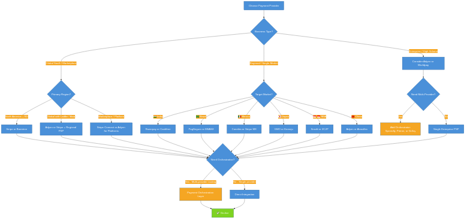
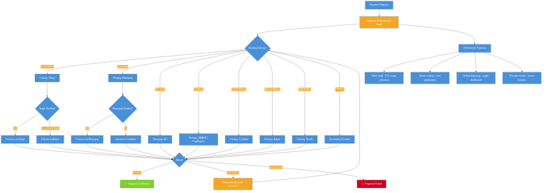

# Payment Provider Deep Dive

## Overview

Choosing the right payment provider — or combination of providers — is one of the most impactful architectural decisions in a commerce system. Each provider has distinct strengths in geographic coverage, payment method support, pricing, developer experience, and enterprise features.

This document provides an in-depth comparison of major **global** and **regional** payment providers, **payment orchestrators**, and practical guidance for provider selection, multi-provider architectures, and migration strategies — all with .NET 10.0+ code examples.

## Table of Contents

1. [Provider Selection Flow](#provider-selection-flow)
2. [Global Payment Providers](#global-payment-providers)
3. [Regional Payment Providers](#regional-payment-providers)
4. [Payment Orchestrators](#payment-orchestrators)
5. [Provider Comparison Matrix](#provider-comparison-matrix)
6. [Provider Selection Framework](#provider-selection-framework)
7. [Multi-Provider Architecture](#multi-provider-architecture)
8. [Provider Migration Strategies](#provider-migration-strategies)
9. [Flow Diagrams](#flow-diagrams)

---

## Provider Selection Flow

The following diagram walks through the decision process for selecting the right payment provider(s) based on business type, target regions, and architecture needs.



<details>
<summary>View Mermaid source</summary>

See [`diagrams/provider-selection-flow.mmd`](diagrams/provider-selection-flow.mmd)

</details>

---

## Global Payment Providers

### Stripe

| Attribute | Details |
|-----------|---------|
| **Headquarters** | San Francisco, USA |
| **Founded** | 2010 |
| **Coverage** | 47+ countries (acquiring), 135+ currencies |
| **Key APIs** | Payment Intents, Checkout Sessions, Connect (marketplace), Billing (subscriptions), Issuing (card issuing), Terminal (in-person), Radar (fraud), Treasury (banking-as-a-service) |
| **Pricing** | 2.9% + $0.30 (US cards), 1.5% + €0.25 (EU/EEA cards in EU), +1% cross-border, +1% FX. Volume discounts available. |
| **Settlement** | T+2 standard, T+1 available for established accounts |
| **Developer experience** | Excellent docs, SDKs for 10+ languages, CLI, test mode, webhooks, real-time dashboard |
| **PCI scope** | SAQ A with Stripe.js / Elements (no card data on your server) |

**Strengths:**
- Best-in-class developer experience and documentation
- Stripe Connect is the leading marketplace/platform payments product
- Comprehensive suite: payments, billing, invoicing, issuing, treasury, identity
- Strong 3DS2/SCA support with intelligent exemptions (Radar)
- Global reach with local acquiring in many markets

**Limitations:**
- Higher pricing than enterprise negotiated rates
- Limited in some markets (e.g., India has fewer local methods than Razorpay)
- Connect's complexity can be challenging for simple multi-party setups
- Payout timing in some countries is slower than local providers

**Best for:** SaaS, marketplaces, platforms, startups, developer-centric teams.

> For detailed Stripe integration code, see [16-STRIPE-INTEGRATION.md](16-STRIPE-INTEGRATION.md).

#### Stripe — Key Integration Patterns

```csharp
// Stripe Payment Intent with multi-region support
public class StripeProviderAdapter : IPaymentGateway
{
    private readonly IStripeClient _client;
    private readonly ILogger<StripeProviderAdapter> _logger;

    public string ProviderName => "Stripe";

    public async Task<PaymentResult> ProcessPaymentAsync(PaymentRequest request)
    {
        using var activity = ActivitySource.StartActivity("Stripe.ProcessPayment");
        activity?.SetTag("provider", "stripe");
        activity?.SetTag("payment.currency", request.Currency);

        var options = new PaymentIntentCreateOptions
        {
            Amount = ConvertToSmallestUnit(request.Amount, request.Currency),
            Currency = request.Currency.ToLower(),
            PaymentMethod = request.PaymentMethodToken,
            Confirm = true,
            IdempotencyKey = request.IdempotencyKey,
            // Dynamic 3DS based on region
            PaymentMethodOptions = new PaymentIntentPaymentMethodOptionsOptions
            {
                Card = new PaymentIntentPaymentMethodOptionsCardOptions
                {
                    RequestThreeDSecure = request.Requires3DS ? "any" : "automatic"
                }
            },
            Metadata = new Dictionary<string, string>
            {
                ["order_id"] = request.OrderId,
                ["region"] = request.Region
            }
        };

        var service = new PaymentIntentService(_client);
        var intent = await service.CreateAsync(options);

        return new PaymentResult
        {
            TransactionId = intent.Id,
            ProviderName = ProviderName,
            Status = MapStatus(intent.Status),
            RequiresAction = intent.Status == "requires_action",
            ActionUrl = intent.NextAction?.RedirectToUrl?.Url
        };
    }

    public async Task<RefundResult> RefundAsync(string transactionId, decimal? amount = null)
    {
        var service = new RefundService(_client);
        var options = new RefundCreateOptions
        {
            PaymentIntent = transactionId,
            Amount = amount.HasValue
                ? ConvertToSmallestUnit(amount.Value, "usd") // Use actual currency
                : null
        };

        var refund = await service.CreateAsync(options);
        return new RefundResult
        {
            RefundId = refund.Id,
            Status = refund.Status == "succeeded"
                ? RefundStatus.Completed
                : RefundStatus.Pending
        };
    }

    public async Task<bool> IsHealthyAsync()
    {
        try
        {
            var service = new BalanceService(_client);
            await service.GetAsync();
            return true;
        }
        catch
        {
            return false;
        }
    }
}
```

---

### PayPal

| Attribute | Details |
|-----------|---------|
| **Headquarters** | San Jose, USA |
| **Founded** | 1998 |
| **Coverage** | 200+ markets, 100+ currencies |
| **Key APIs** | Orders API v2, Subscriptions, Payouts, Disputes, Checkout SDK, Braintree (subsidiary) |
| **Pricing** | 2.99% + $0.49 (US), 3.49% + $0.49 (international), +1.5% FX. Micropayments rate available. |
| **Settlement** | Instant to PayPal balance, 1–3 days to bank |
| **Developer experience** | Good docs, REST API v2 is clean. Legacy v1 APIs still present which can confuse. |
| **PCI scope** | SAQ A — PayPal handles all card data (redirect/hosted flow) |

**Strengths:**
- Largest global buyer network (~430M+ active accounts)
- Strong buyer protection builds consumer trust
- PayPal Checkout drives higher conversion through one-click
- Comprehensive: Venmo (US), PayPal Credit, Pay Later
- Excellent dispute/chargeback management tools

**Limitations:**
- Higher fees than card-direct processing for merchants
- Account holds/freezes on new or high-risk merchants
- Complex fee structure with many conditional add-ons
- Seller protection has limitations on digital goods
- API versioning can be confusing (v1 vs v2)

**Best for:** Consumer-facing e-commerce, international sellers, trust-sensitive verticals.

> For detailed PayPal integration code, see [17-PAYPAL-INTEGRATION.md](17-PAYPAL-INTEGRATION.md).

---

### Adyen

| Attribute | Details |
|-----------|---------|
| **Headquarters** | Amsterdam, Netherlands |
| **Founded** | 2006 |
| **Coverage** | 200+ markets, 250+ payment methods, 150+ currencies |
| **Key APIs** | Checkout API, Payments API, Recurring, Platforms (marketplace), Data Protection, Disputes |
| **Pricing** | Processing fee per transaction + interchange++ or blended. Typically €0.10–0.12 + interchange. Volume-based. |
| **Settlement** | Configurable — daily, weekly, or custom schedules |
| **Developer experience** | Good API design, comprehensive test platform. Enterprise-focused onboarding. |
| **PCI scope** | SAQ A with Drop-in / Components, SAQ D for full API |

**Strengths:**
- Widest global coverage with local acquiring in 40+ countries
- Best-in-class local payment method support (250+)
- Unified commerce (online + in-store via POS terminals)
- RevenueProtect — advanced ML-based fraud prevention
- Interchange++ pricing is transparent and often cheaper at scale
- Adyen for Platforms — marketplace payments comparable to Stripe Connect

**Limitations:**
- Enterprise-focused — not ideal for small businesses (minimum monthly commitment)
- Steeper learning curve than Stripe
- Onboarding process can be slow (weeks vs. minutes with Stripe)
- Documentation is comprehensive but less developer-friendly than Stripe
- Custom pricing requires sales negotiation

**Best for:** Enterprise, high-volume merchants, unified commerce (online + POS), global expansion.

#### Adyen — Key Integration Patterns

```csharp
public class AdyenProviderAdapter : IPaymentGateway
{
    private readonly HttpClient _httpClient;
    private readonly AdyenSettings _settings;

    public string ProviderName => "Adyen";

    public async Task<PaymentResult> ProcessPaymentAsync(PaymentRequest request)
    {
        using var activity = ActivitySource.StartActivity("Adyen.ProcessPayment");
        activity?.SetTag("provider", "adyen");

        var paymentRequest = new
        {
            merchantAccount = _settings.MerchantAccount,
            amount = new
            {
                value = ConvertToSmallestUnit(request.Amount, request.Currency),
                currency = request.Currency.ToUpper()
            },
            reference = request.OrderId,
            paymentMethod = new
            {
                type = MapPaymentMethodType(request.PaymentMethodType),
                encryptedCardNumber = request.EncryptedCard?.Number,
                encryptedExpiryMonth = request.EncryptedCard?.ExpiryMonth,
                encryptedExpiryYear = request.EncryptedCard?.ExpiryYear,
                encryptedSecurityCode = request.EncryptedCard?.Cvv
            },
            returnUrl = request.ReturnUrl,
            shopperReference = request.CustomerId,
            shopperInteraction = request.IsRecurring ? "ContAuth" : "Ecommerce",
            recurringProcessingModel = request.IsRecurring ? "Subscription" : null,
            // 3DS2 - Adyen handles SCA natively
            authenticationData = new
            {
                threeDSRequestData = new
                {
                    nativeThreeDS = "preferred"
                }
            },
            channel = "Web",
            // Local payment method routing
            countryCode = request.Region,
            shopperLocale = request.Locale
        };

        var response = await _httpClient.PostAsJsonAsync(
            $"{_settings.BaseUrl}/v71/payments", paymentRequest);
        response.EnsureSuccessStatusCode();

        var result = await response.Content.ReadFromJsonAsync<JsonElement>();

        return new PaymentResult
        {
            TransactionId = result.GetProperty("pspReference").GetString()!,
            ProviderName = ProviderName,
            Status = MapAdyenResultCode(result.GetProperty("resultCode").GetString()!),
            RequiresAction = result.GetProperty("resultCode").GetString() == "RedirectShopper"
                || result.GetProperty("resultCode").GetString() == "ChallengeShopper",
            ActionUrl = result.TryGetProperty("action", out var action)
                ? action.GetProperty("url").GetString()
                : null
        };
    }

    private static PaymentStatus MapAdyenResultCode(string resultCode) => resultCode switch
    {
        "Authorised" => PaymentStatus.Completed,
        "Refused" => PaymentStatus.Declined,
        "Error" => PaymentStatus.Failed,
        "Cancelled" => PaymentStatus.Cancelled,
        "Pending" or "Received" => PaymentStatus.Pending,
        "RedirectShopper" or "IdentifyShopper" or "ChallengeShopper" or "PresentToShopper"
            => PaymentStatus.RequiresAction,
        _ => PaymentStatus.Unknown
    };
}
```

---

### Checkout.com

| Attribute | Details |
|-----------|---------|
| **Headquarters** | London, UK |
| **Founded** | 2012 |
| **Coverage** | 150+ currencies, acquiring in 50+ countries |
| **Key APIs** | Payments, Tokens, Sources, Hosted Payments, Flow (orchestration), Vault |
| **Pricing** | Interchange++ for enterprise. Blended rates available. Competitive at high volume. |
| **Settlement** | T+1 to T+3 depending on region |
| **Developer experience** | Modern REST API, good SDKs, extensive testing tools |

**Strengths:**
- Strong in high-risk verticals (travel, gaming, digital goods)
- Excellent approval rate optimization
- Flow — built-in payment orchestration engine
- Good balance of enterprise features + developer experience
- Competitive interchange++ pricing

**Limitations:**
- Smaller ecosystem than Stripe or Adyen
- Fewer local payment methods than Adyen
- Enterprise sales process required for best rates
- Less brand recognition with end consumers

**Best for:** High-growth companies, performance-sensitive merchants, travel/gaming verticals.

---

### Braintree (PayPal)

| Attribute | Details |
|-----------|---------|
| **Headquarters** | Chicago, USA (subsidiary of PayPal) |
| **Founded** | 2007 (acquired by PayPal 2013) |
| **Coverage** | 45+ countries, 130+ currencies |
| **Key APIs** | Payments, Vault, Subscriptions, PayPal, Venmo, GraphQL API |
| **Pricing** | 2.59% + $0.49 (US), custom enterprise pricing. PayPal/Venmo at same rate. |
| **Settlement** | T+2 standard |

**Strengths:**
- Native PayPal and Venmo integration (same parent company)
- Drop-in UI is polished and easy to implement
- Good for mobile payments (SDK quality)
- GraphQL API is modern and flexible
- Strong recurring billing / vault capabilities

**Limitations:**
- Innovation has slowed since PayPal acquisition
- Fewer local payment methods than Stripe or Adyen
- Enterprise support can be inconsistent
- Less investment in newer payment trends (crypto, BNPL orchestration)

**Best for:** Apps needing PayPal + Venmo + cards in one integration, mobile-first products.

---

### Square

| Attribute | Details |
|-----------|---------|
| **Headquarters** | San Francisco, USA (Block, Inc.) |
| **Founded** | 2009 |
| **Coverage** | USA, Canada, UK, Australia, Japan, France, Spain, Ireland |
| **Key APIs** | Payments, Orders, Catalog, Customers, Subscriptions, Terminal, Invoices |
| **Pricing** | 2.9% + $0.30 (US online), 2.6% + $0.10 (in-person). No monthly fees. |
| **Settlement** | Next business day (US), T+1–2 (other) |

**Strengths:**
- Best unified commerce for SMBs (online + in-person + POS hardware)
- No monthly fees — true pay-as-you-go
- Integrated business tools (inventory, CRM, marketing, payroll)
- Cash App integration (Block ecosystem)
- Hardware ecosystem (Square Terminal, Register, Reader)

**Limitations:**
- Limited international coverage (8 countries)
- Not designed for high-volume enterprise processing
- Account stability concerns — abrupt holds/terminations
- Fewer payment methods than Stripe/Adyen
- API is functional but not as polished as Stripe

**Best for:** SMBs, retail, restaurants, service businesses, unified online + in-person.

---

### Worldpay (FIS)

| Attribute | Details |
|-----------|---------|
| **Headquarters** | Cincinnati, USA (FIS subsidiary) |
| **Founded** | 1989 |
| **Coverage** | 146+ countries, 135+ currencies |
| **Key APIs** | Payments, Tokenization, Fraud Management, Reporting |
| **Pricing** | Custom enterprise pricing. Interchange++ or blended. |
| **Settlement** | Configurable — T+1 to T+5 |

**Strengths:**
- One of the largest processors globally by transaction volume
- Deep bank relationships and acquiring capabilities
- Strong in enterprise and legacy industries
- Comprehensive fraud management suite
- Local acquiring in many markets

**Limitations:**
- Legacy technology stack — modernization ongoing
- Developer experience significantly behind Stripe/Adyen
- Long onboarding and integration timelines (months)
- Complex organizational structure post-mergers
- Documentation quality varies

**Best for:** Large enterprises, banks, legacy system integrations, high-volume card processing.

---

## Regional Payment Providers

### India

#### Razorpay

| Attribute | Details |
|-----------|---------|
| **Headquarters** | Bangalore, India |
| **Founded** | 2014 |
| **Coverage** | India (primary), expanding internationally |
| **Payment Methods** | UPI, cards (Visa, MC, RuPay), netbanking (60+ banks), wallets (Paytm, PhonePe), EMI (card + cardless), recurring mandates (e-NACH, UPI AutoPay) |
| **Pricing** | 2% per transaction (cards/netbanking), 0% on UPI (passed through). Custom enterprise rates. |
| **Settlement** | T+2 standard, T+1 and instant available |
| **RBI compliance** | PA/PG licensed, card tokenization compliant, e-mandate compliant |

**Strengths:**
- Most comprehensive India payments coverage
- Razorpay X — business banking (payroll, vendor payments, tax)
- RazorpayX Payroll — automated payroll + compliance
- Route — marketplace/split payment product
- Strong dashboard and analytics
- Excellent documentation for Indian context

**Limitations:**
- International coverage is limited
- Enterprise support can be slow for smaller accounts
- Some stability concerns during peak traffic (IPL, sales events)

#### Cashfree

| Attribute | Details |
|-----------|---------|
| **Headquarters** | Bangalore, India |
| **Founded** | 2015 |
| **Coverage** | India |
| **Payment Methods** | UPI, cards, netbanking, wallets, EMI, Pay Later, AutoCollect, international cards |
| **Pricing** | 1.90%–1.95% (cards), 0% (UPI, up to limits). Competitive for payouts. |
| **Settlement** | T+1 standard, instant settlement available |

**Strengths:**
- Fast settlement (instant available)
- Strong payout APIs (bank transfers, UPI payouts)
- Auto Collect — virtual account-based collections
- Verification Suite — bank account, UPI ID, PAN, Aadhaar verification
- Competitive pricing

#### Juspay

| Attribute | Details |
|-----------|---------|
| **Headquarters** | Bangalore, India |
| **Founded** | 2012 |
| **Coverage** | India, expanding to SEA |
| **Type** | Payment orchestrator (not a PSP — routes to multiple gateways) |

**Strengths:**
- Powers payments for Amazon India, Flipkart, Swiggy, and other large merchants
- HyperSDK — native mobile SDK with seamless UPI intent flow
- Express Checkout — saved payment methods across merchants
- Gateway health monitoring and smart routing
- Best UPI success rates through intelligent retry logic

---

### Latin America

#### PagSeguro (Brazil)

| Attribute | Details |
|-----------|---------|
| **Headquarters** | São Paulo, Brazil |
| **Founded** | 2006 |
| **Coverage** | Brazil |
| **Payment Methods** | Pix, Boleto, credit cards (installments up to 18x), debit cards (Elo, Hipercard, Visa, MC), PagBank wallet |
| **Pricing** | 3.99%–4.99% per transaction (standard), lower for enterprise. Installment fees vary. |
| **Settlement** | T+14 standard (cards), instant (Pix) |

**Strengths:**
- Full-stack Brazilian PSP (payments, banking, POS)
- PagBank — digital banking for consumers
- Strong SMB ecosystem with hardware (maquininhas)
- Boleto generation and reconciliation built-in

#### EBANX

| Attribute | Details |
|-----------|---------|
| **Headquarters** | Curitiba, Brazil |
| **Founded** | 2012 |
| **Coverage** | Brazil, Mexico, Colombia, Chile, Argentina, Peru, Uruguay, Bolivia, Ecuador |
| **Type** | Cross-border payment specialist |

**Strengths:**
- Connects international merchants to Latin American payment methods
- Single integration for 15+ LatAm countries
- Handles local tax complexity (CPF collection, IOF, etc.)
- EBANX Pay — white-label checkout page
- Strong FX management — merchants settle in USD/EUR

**Best for:** International companies expanding to Latin America without local entities.

#### Mercado Pago (Latin America)

| Attribute | Details |
|-----------|---------|
| **Headquarters** | Buenos Aires, Argentina |
| **Coverage** | Brazil, Mexico, Argentina, Colombia, Chile, Peru, Uruguay |
| **Parent** | Mercado Libre (largest LatAm e-commerce platform) |

**Strengths:**
- Largest digital wallet in Latin America
- Mercado Crédito — BNPL and lending
- QR code payments — strong in-person adoption
- Built-in buyer protection and dispute resolution
- Deep integration with Mercado Libre marketplace

#### Conekta (Mexico)

| Attribute | Details |
|-----------|---------|
| **Headquarters** | Mexico City, Mexico |
| **Founded** | 2012 |
| **Coverage** | Mexico |
| **Payment Methods** | Cards (Visa, MC, Amex), OXXO, SPEI, MSI (installments 3/6/9/12 months) |
| **Pricing** | 2.9% + $2.50 MXN (cards), $6 MXN per OXXO, $4 MXN per SPEI |

**Strengths:**
- Best OXXO integration (20,000+ convenience stores)
- MSI (Meses sin Intereses) — installment management
- SPEI (instant bank transfer) built-in
- CFDI invoice support for SAT compliance

---

### Southeast Asia

#### Xendit

| Attribute | Details |
|-----------|---------|
| **Headquarters** | Jakarta, Indonesia |
| **Founded** | 2015 |
| **Coverage** | Indonesia, Philippines, Singapore, Malaysia, Thailand, Vietnam |
| **Payment Methods** | Cards, e-wallets (GoPay, OVO, DANA, GCash, Maya), bank transfers, QR codes, direct debit, retail outlets |
| **Pricing** | Varies by country and method. ~2.9% for cards, lower for bank transfers. |

**Strengths:**
- Deep Southeast Asian coverage with local acquiring
- Strong in Indonesia (largest SEA market by population)
- Disbursements API — payouts to bank accounts and e-wallets
- Virtual accounts for collections
- Real-time payment notifications

#### 2C2P

| Attribute | Details |
|-----------|---------|
| **Headquarters** | Bangkok, Thailand |
| **Founded** | 2003 |
| **Coverage** | Thailand, Singapore, Malaysia, Indonesia, Philippines, Vietnam, Myanmar, Cambodia, Laos, Hong Kong |
| **Payment Methods** | 250+ payment methods across SEA |

**Strengths:**
- Widest payment method coverage in SEA
- Strong in Thailand (home market)
- Cross-border payments within SEA
- Installment payments across SEA markets
- Bill payment and top-up services

---

### Japan

#### GMO Payment Gateway

| Attribute | Details |
|-----------|---------|
| **Headquarters** | Tokyo, Japan |
| **Founded** | 1995 |
| **Coverage** | Japan |
| **Payment Methods** | Credit cards (JCB, Visa, MC, Amex, Diners), Konbini, bank transfer (Furikomi), carrier billing (docomo, au, SoftBank), PayPay, electronic money (Suica, Pasmo), Amazon Pay Japan |

**Strengths:**
- Largest online payment gateway in Japan
- Most comprehensive Japanese payment method coverage
- Installment payments (Bunkatsu) and bonus pay support
- Strong enterprise customer base
- Excellent local regulatory compliance

#### Komoju

| Attribute | Details |
|-----------|---------|
| **Headquarters** | Tokyo, Japan |
| **Founded** | 2011 |
| **Type** | Payment aggregator for international merchants entering Japan |

**Strengths:**
- Simplifies Japan market entry for foreign merchants
- Single API for all Japanese payment methods
- English-language support and documentation
- Faster onboarding than GMO for international companies
- Good Shopify and WooCommerce integrations

---

### China (Cross-Border)

#### Airwallex

| Attribute | Details |
|-----------|---------|
| **Headquarters** | Melbourne, Australia / Hong Kong |
| **Founded** | 2015 |
| **Coverage** | Global (strong in APAC + China cross-border) |

**Strengths:**
- Best-in-class FX rates and multi-currency accounts
- Global Accounts — receive payments in local currencies without local entities
- Strong WeChat Pay and Alipay cross-border integration
- Embedded finance APIs (accounts, cards, transfers)
- Competitive for cross-border e-commerce between APAC and the West

---

## Payment Orchestrators

Payment orchestrators sit between your application and multiple payment providers, offering a unified API to route transactions, manage tokens, optimize costs, and increase resilience.

### When to Use an Orchestrator

| Signal | Recommendation |
|--------|---------------|
| Single provider, low volume | ❌ Direct integration — orchestrator is overkill |
| Single provider, high volume | ⚠️ Consider for failover and token portability |
| Multiple providers, regional routing | ✅ Strong fit — unified API, smart routing |
| Multiple providers, cost optimization | ✅ Strong fit — interchange optimization, least-cost routing |
| PCI scope reduction needed | ✅ Orchestrator vaults reduce your PCI burden |

### Spreedly

| Attribute | Details |
|-----------|---------|
| **Headquarters** | Durham, NC, USA |
| **Founded** | 2008 |
| **Key Feature** | Universal token vault + gateway routing |
| **Supported Gateways** | 120+ payment gateways |
| **Pricing** | Per-transaction fee ($0.03–0.10) + monthly platform fee |

**Strengths:**
- Largest network of pre-built gateway connections
- Universal vault — tokenize once, use across any gateway
- Token migration — move tokens between providers without re-collecting cards
- PCI Level 1 certified — reduces your PCI scope
- Lifecycle management — keep stored cards updated (account updater)

**Limitations:**
- Adds latency (extra hop between you and the gateway)
- Additional cost layer on top of gateway fees
- Can limit access to provider-specific features
- Debugging is harder with an intermediary

### Primer

| Attribute | Details |
|-----------|---------|
| **Headquarters** | London, UK |
| **Founded** | 2020 |
| **Key Feature** | Universal checkout + workflow automation |
| **Supported Gateways** | 30+ payment processors |

**Strengths:**
- Workflows — visual payment flow builder (retry, routing, 3DS triggers)
- Universal Checkout — drop-in UI that adapts to region/method
- Observability — built-in monitoring and analytics across providers
- No-code routing rules — change provider routing without deployments
- Modern architecture — designed for modern payment stack

### Gr4vy

| Attribute | Details |
|-----------|---------|
| **Headquarters** | San Francisco, USA |
| **Founded** | 2020 |
| **Key Feature** | Cloud-native payment orchestration platform |
| **Supported Gateways** | 60+ processors and payment methods |

**Strengths:**
- Cloud-hosted vault — reduces PCI scope to SAQ A
- Visual flow builder for routing rules
- Embeddable checkout components
- Built-in retry and failover logic
- Open-source SDKs

### Orchestrator Comparison

| Feature | Spreedly | Primer | Gr4vy |
|---------|----------|--------|-------|
| Gateway connections | 120+ | 30+ | 60+ |
| Universal vault | ✅ | ✅ | ✅ |
| Smart routing | ✅ | ✅ (visual workflows) | ✅ |
| Drop-in checkout | ❌ (API only) | ✅ | ✅ |
| No-code rules | ❌ | ✅ | ✅ |
| Token migration | ✅ | ✅ | ✅ |
| PCI scope reduction | SAQ A-EP → SAQ A | SAQ A | SAQ A |
| Pricing model | Per-txn + platform | Per-txn + platform | Per-txn + platform |
| Maturity | High (since 2008) | Medium (since 2020) | Medium (since 2020) |

---

## Provider Comparison Matrix

### Feature Comparison

| Feature | Stripe | PayPal | Adyen | Checkout.com | Braintree | Square | Worldpay |
|---------|--------|--------|-------|-------------|-----------|--------|----------|
| **Card processing** | ✅ | ✅ | ✅ | ✅ | ✅ | ✅ | ✅ |
| **Local payment methods** | 40+ | 20+ | 250+ | 30+ | 15+ | 5+ | 30+ |
| **Marketplace/platform** | Connect | Commerce Platform | Platforms | ❌ | Marketplace | ❌ | ❌ |
| **Recurring billing** | ✅ Billing | ✅ Subscriptions | ✅ | ✅ | ✅ | ✅ | ✅ |
| **In-person POS** | Terminal | Zettle | POS terminals | ❌ | ❌ | ✅ (best) | ✅ |
| **Fraud prevention** | Radar | Fraud Protection | RevenueProtect | Fraud Detection | Fraud tools | Risk Manager | Fraud management |
| **3DS2 / SCA** | ✅ Native | ✅ | ✅ Native | ✅ Native | ✅ | ✅ | ✅ |
| **Card issuing** | Issuing | ❌ | Issuing | ❌ | ❌ | ❌ | ❌ |
| **Banking / Treasury** | Treasury | ❌ | ❌ | ❌ | ❌ | Banking | ❌ |
| **Payouts** | Connect payouts | Payouts | Platforms | ❌ | ❌ | ❌ | ❌ |
| **Developer experience** | ⭐⭐⭐⭐⭐ | ⭐⭐⭐ | ⭐⭐⭐⭐ | ⭐⭐⭐⭐ | ⭐⭐⭐ | ⭐⭐⭐ | ⭐⭐ |

### Pricing Comparison (US Market)

| Provider | Standard Card Rate | International | FX Fee | Monthly Fee |
|----------|-------------------|---------------|--------|-------------|
| **Stripe** | 2.9% + $0.30 | +1.0% | +1.0% | None |
| **PayPal** | 2.99% + $0.49 | +1.5% | +2.5% | None |
| **Adyen** | ~€0.10 + IC++ | Included in IC++ | ~1.0% | Yes (minimum) |
| **Checkout.com** | IC++ negotiated | Included in IC++ | ~1.0% | Yes |
| **Braintree** | 2.59% + $0.49 | +1.0% | +1.0% | None |
| **Square** | 2.9% + $0.30 | N/A (limited) | N/A | None |
| **Worldpay** | Custom (IC++) | Custom | Custom | Yes |

> **IC++** = Interchange + Card Network Assessment + Processor Markup. More transparent but requires volume for best rates.

### Regional Coverage

| Provider | 🇺🇸 USA | 🇪🇺 Europe | 🇬🇧 UK | 🇮🇳 India | 🇧🇷 Brazil | 🇲🇽 Mexico | 🇯🇵 Japan | 🇸🇬 Singapore | 🇨🇳 China |
|----------|---------|-----------|--------|----------|----------|----------|---------|-------------|---------|
| **Stripe** | ✅ Local | ✅ Local | ✅ Local | ✅ Limited | ✅ Local | ✅ Local | ✅ Local | ✅ Local | ❌ CB only |
| **PayPal** | ✅ | ✅ | ✅ | ✅ | ✅ | ✅ | ✅ | ✅ | ❌ |
| **Adyen** | ✅ Local | ✅ Local | ✅ Local | ✅ Local | ✅ Local | ✅ Local | ✅ Local | ✅ Local | ✅ CB |
| **Checkout.com** | ✅ Local | ✅ Local | ✅ Local | ❌ | ❌ | ❌ | ❌ | ✅ Local | ❌ |
| **Razorpay** | ❌ | ❌ | ❌ | ✅ Best | ❌ | ❌ | ❌ | ❌ | ❌ |
| **EBANX** | ❌ | ❌ | ❌ | ❌ | ✅ Best | ✅ | ❌ | ❌ | ❌ |
| **Xendit** | ❌ | ❌ | ❌ | ❌ | ❌ | ❌ | ❌ | ✅ | ❌ |

> **Local** = local acquiring (better approval rates, lower fees). **CB** = cross-border only. **Best** = deepest local method support.

---

## Provider Selection Framework

### Decision Criteria Scorecard

Rate each provider on these dimensions (1–5 scale) based on your specific requirements:

| Criterion | Weight | Questions to Ask |
|-----------|--------|-----------------|
| **Geographic coverage** | High | Does the provider support local acquiring in your target markets? |
| **Payment method coverage** | High | Does it support the local methods your customers prefer? |
| **Pricing** | High | What is the all-in cost (base rate + cross-border + FX + monthly)? |
| **Developer experience** | Medium | How fast can your team integrate? Quality of docs, SDKs, sandbox? |
| **Reliability / uptime** | High | What is the provider's SLA? Status page history? |
| **Fraud prevention** | Medium | Built-in ML fraud scoring? 3DS2 optimization? Chargeback management? |
| **Settlement speed** | Medium | T+1 or T+2? Does it support instant settlement? |
| **Support quality** | Medium | Response times? Dedicated account manager? Technical support quality? |
| **PCI scope** | Medium | Does it offer hosted/tokenized flows for SAQ A? |
| **Regulatory compliance** | High | Is it licensed in your target markets? GDPR, RBI, PSD2 compliant? |
| **Scalability** | Medium | Can it handle your peak volumes? Auto-scaling? Rate limits? |
| **Lock-in risk** | Low | Token portability? Data export? Migration feasibility? |

### Common Provider Combinations

| Business Type | Primary | Secondary | Orchestrator | Notes |
|--------------|---------|-----------|-------------|-------|
| **US SaaS** | Stripe | PayPal | None | Stripe for cards, PayPal for wallet users |
| **EU E-commerce** | Adyen | Stripe | None | Adyen for local methods, Stripe as fallback |
| **Global Marketplace** | Stripe Connect | Adyen | Spreedly | Connect for payouts, Adyen for local acquiring |
| **India D2C** | Razorpay | Cashfree | Juspay | Razorpay primary, Cashfree for payouts, Juspay for UPI optimization |
| **LatAm Expansion** | Stripe | EBANX | None | Stripe for cards, EBANX for local methods |
| **SEA Mobile App** | Xendit | Stripe | None | Xendit for wallets/banks, Stripe for cards |
| **Enterprise Global** | Adyen | Worldpay | Primer | Adyen primary, Worldpay for legacy, Primer for routing |

---

## Multi-Provider Architecture

### Routing Flow



<details>
<summary>View Mermaid source</summary>

See [`diagrams/multi-provider-routing-flow.mmd`](diagrams/multi-provider-routing-flow.mmd)

</details>

### Unified Provider Interface

All providers implement a common interface to enable provider-agnostic business logic:

```csharp
public interface IPaymentGateway
{
    string ProviderName { get; }
    Task<PaymentResult> ProcessPaymentAsync(PaymentRequest request);
    Task<RefundResult> RefundAsync(string transactionId, decimal? amount = null);
    Task<PaymentStatus> GetStatusAsync(string transactionId);
    Task<bool> IsHealthyAsync();
    IReadOnlyList<PaymentMethodType> SupportedMethods { get; }
    IReadOnlyList<string> SupportedRegions { get; }
}

public record PaymentRequest
{
    public string OrderId { get; init; } = "";
    public decimal Amount { get; init; }
    public string Currency { get; init; } = "";
    public string PaymentMethodToken { get; init; } = "";
    public PaymentMethodType PaymentMethodType { get; init; }
    public string Region { get; init; } = "";
    public string Locale { get; init; } = "";
    public string CustomerId { get; init; } = "";
    public string IdempotencyKey { get; init; } = "";
    public string ReturnUrl { get; init; } = "";
    public bool Requires3DS { get; init; }
    public bool IsRecurring { get; init; }
    public int Installments { get; init; } = 1;
    public string? CustomerTaxId { get; init; }
    public EncryptedCardData? EncryptedCard { get; init; }
    public Dictionary<string, string> Metadata { get; init; } = new();
}

public record PaymentResult
{
    public string TransactionId { get; init; } = "";
    public string ProviderName { get; init; } = "";
    public PaymentStatus Status { get; init; }
    public bool RequiresAction { get; init; }
    public string? ActionUrl { get; init; }
    public string? ErrorCode { get; init; }
    public string? ErrorMessage { get; init; }
}
```

### Smart Routing Service

```csharp
public class SmartPaymentRouter
{
    private readonly IEnumerable<IPaymentGateway> _gateways;
    private readonly IProviderHealthMonitor _healthMonitor;
    private readonly IProviderRoutingConfig _routingConfig;
    private readonly ILogger<SmartPaymentRouter> _logger;

    public async Task<PaymentResult> RoutePaymentAsync(PaymentRequest request)
    {
        // 1. Determine eligible providers for this request
        var eligibleProviders = _gateways
            .Where(g => g.SupportedRegions.Contains(request.Region))
            .Where(g => g.SupportedMethods.Contains(request.PaymentMethodType))
            .ToList();

        if (eligibleProviders.Count == 0)
            throw new NotSupportedException(
                $"No provider supports {request.PaymentMethodType} in {request.Region}");

        // 2. Sort by routing priority (cost, success rate, health)
        var sortedProviders = eligibleProviders
            .OrderByDescending(g => _healthMonitor.GetHealthScore(g.ProviderName))
            .ThenBy(g => _routingConfig.GetCostRank(g.ProviderName, request.Region))
            .ToList();

        // 3. Attempt primary provider, failover to secondary
        foreach (var provider in sortedProviders)
        {
            if (!await _healthMonitor.IsCircuitClosedAsync(provider.ProviderName))
            {
                _logger.LogWarning("Circuit open for {Provider}, skipping",
                    provider.ProviderName);
                continue;
            }

            try
            {
                var result = await provider.ProcessPaymentAsync(request);

                if (result.Status == PaymentStatus.Declined
                    && IsSoftDecline(result.ErrorCode)
                    && sortedProviders.IndexOf(provider) < sortedProviders.Count - 1)
                {
                    _logger.LogInformation(
                        "Soft decline from {Provider}, retrying with next provider",
                        provider.ProviderName);
                    continue; // Try next provider
                }

                return result;
            }
            catch (Exception ex)
            {
                _logger.LogError(ex, "Error processing via {Provider}", provider.ProviderName);
                _healthMonitor.RecordFailure(provider.ProviderName);

                if (sortedProviders.IndexOf(provider) == sortedProviders.Count - 1)
                    throw; // Last provider — rethrow
            }
        }

        throw new InvalidOperationException("All providers exhausted");
    }

    private static bool IsSoftDecline(string? errorCode) =>
        errorCode is "insufficient_funds" or "card_declined" or "processing_error"
            or "try_again_later" or "issuer_not_available";
}
```

### Provider Health Monitor

```csharp
public class ProviderHealthMonitor : IProviderHealthMonitor
{
    private readonly ConcurrentDictionary<string, ProviderHealth> _health = new();
    private readonly IOptions<HealthMonitorConfig> _config;

    public double GetHealthScore(string providerName)
    {
        if (!_health.TryGetValue(providerName, out var health))
            return 1.0; // Unknown providers get full score

        var recentWindow = TimeSpan.FromMinutes(_config.Value.WindowMinutes);
        var recentRequests = health.GetRecentRequests(recentWindow);

        if (recentRequests.Total == 0) return 1.0;

        return (double)recentRequests.Successful / recentRequests.Total;
    }

    public async Task<bool> IsCircuitClosedAsync(string providerName)
    {
        if (!_health.TryGetValue(providerName, out var health))
            return true;

        // Open circuit if failure rate exceeds threshold
        var score = GetHealthScore(providerName);
        if (score < _config.Value.CircuitOpenThreshold)
        {
            // Check if enough time has passed for half-open
            if (health.CircuitOpenedAt.HasValue
                && DateTime.UtcNow - health.CircuitOpenedAt.Value
                    > TimeSpan.FromSeconds(_config.Value.CircuitResetSeconds))
            {
                return true; // Half-open — allow one request through
            }
            return false; // Circuit open
        }

        return true;
    }

    public void RecordSuccess(string providerName)
    {
        var health = _health.GetOrAdd(providerName, _ => new ProviderHealth());
        health.RecordSuccess();
    }

    public void RecordFailure(string providerName)
    {
        var health = _health.GetOrAdd(providerName, _ => new ProviderHealth());
        health.RecordFailure();
    }
}
```

### DI Registration

```csharp
// Program.cs — Multi-provider registration
builder.Services.AddKeyedScoped<IPaymentGateway, StripeProviderAdapter>("Stripe");
builder.Services.AddKeyedScoped<IPaymentGateway, AdyenProviderAdapter>("Adyen");
builder.Services.AddKeyedScoped<IPaymentGateway, RazorpayProviderAdapter>("Razorpay");
builder.Services.AddKeyedScoped<IPaymentGateway, EbanxProviderAdapter>("EBANX");
builder.Services.AddKeyedScoped<IPaymentGateway, XenditProviderAdapter>("Xendit");
builder.Services.AddKeyedScoped<IPaymentGateway, ConektaProviderAdapter>("Conekta");

builder.Services.AddScoped<SmartPaymentRouter>();
builder.Services.AddSingleton<IProviderHealthMonitor, ProviderHealthMonitor>();

// Routing config
builder.Services.Configure<ProviderRoutingConfig>(config =>
{
    config.PrimaryProviders = new Dictionary<string, string>
    {
        ["US"] = "Stripe",
        ["EU"] = "Adyen",
        ["IN"] = "Razorpay",
        ["BR"] = "EBANX",
        ["MX"] = "Conekta",
        ["SG"] = "Stripe",
        ["JP"] = "Stripe",
    };

    config.FallbackProviders = new Dictionary<string, string>
    {
        ["US"] = "Adyen",
        ["EU"] = "Stripe",
        ["IN"] = "Cashfree",
        ["BR"] = "Stripe",
        ["MX"] = "Stripe",
    };
});
```

---

## Provider Migration Strategies

### Why Migrate?

| Reason | Example |
|--------|---------|
| **Cost reduction** | Moving from blended to IC++ pricing |
| **Better coverage** | Adding a provider with local acquiring in new markets |
| **Feature needs** | Marketplace features, better fraud tools, etc. |
| **Reliability** | Provider stability or support quality issues |
| **Compliance** | New regulations requiring locally licensed providers |

### Migration Approaches

#### 1. Parallel Running (Recommended)

Run old and new providers simultaneously, gradually shifting traffic.

```csharp
public class MigrationPaymentRouter
{
    private readonly IPaymentGateway _oldProvider;
    private readonly IPaymentGateway _newProvider;
    private readonly IMigrationConfig _config;

    public async Task<PaymentResult> ProcessPaymentAsync(PaymentRequest request)
    {
        // Gradual rollout by percentage
        var useNewProvider = ShouldUseNewProvider(request);

        var provider = useNewProvider ? _newProvider : _oldProvider;

        try
        {
            return await provider.ProcessPaymentAsync(request);
        }
        catch when (useNewProvider)
        {
            // Automatic fallback to old provider during migration
            return await _oldProvider.ProcessPaymentAsync(request);
        }
    }

    private bool ShouldUseNewProvider(PaymentRequest request)
    {
        // Phase 1: 5% of traffic
        // Phase 2: 25% of traffic
        // Phase 3: 50% of traffic
        // Phase 4: 100% of traffic
        var percentage = _config.NewProviderPercentage; // e.g., 25
        var hash = Math.Abs(request.OrderId.GetHashCode()) % 100;
        return hash < percentage;
    }
}
```

#### 2. Token Migration

Move stored payment methods (tokens) from old provider to new provider.

```csharp
public class TokenMigrationService
{
    private readonly IPaymentGateway _oldProvider;
    private readonly IPaymentGateway _newProvider;
    private readonly ITokenVault _vault;

    public async Task<TokenMigrationResult> MigrateCustomerTokensAsync(
        string customerId)
    {
        // Option A: Use orchestrator (Spreedly) for direct token transfer
        // Option B: Re-tokenize via network tokens (Visa/MC token service)
        // Option C: Ask customers to re-enter cards (worst UX, last resort)

        var oldTokens = await _vault.GetTokensForCustomerAsync(
            customerId, _oldProvider.ProviderName);

        var results = new List<TokenMigrationItem>();
        foreach (var token in oldTokens)
        {
            try
            {
                // Network tokenization allows provider-agnostic tokens
                var networkToken = await _oldProvider.GetNetworkTokenAsync(token.TokenId);
                var newToken = await _newProvider.CreateTokenFromNetworkTokenAsync(
                    networkToken);

                results.Add(new TokenMigrationItem
                {
                    OldTokenId = token.TokenId,
                    NewTokenId = newToken.TokenId,
                    Status = MigrationStatus.Success
                });
            }
            catch (Exception ex)
            {
                results.Add(new TokenMigrationItem
                {
                    OldTokenId = token.TokenId,
                    Status = MigrationStatus.Failed,
                    Error = ex.Message
                });
            }
        }

        return new TokenMigrationResult { Items = results };
    }
}
```

### Migration Checklist

- [ ] **Pre-migration**: Set up new provider account, sandbox testing, webhook endpoints
- [ ] **Token audit**: Inventory all stored payment methods that need migration
- [ ] **Parallel webhooks**: Configure both providers to send webhooks during transition
- [ ] **Gradual rollout**: Start with 5% traffic, monitor success rates, increase gradually
- [ ] **Reconciliation**: Ensure both providers' transactions appear in your reporting
- [ ] **Subscription migration**: Plan recurring billing cutover carefully (avoid double-charging)
- [ ] **Refund handling**: Old-provider transactions must be refunded through the old provider
- [ ] **Customer communication**: Notify customers if they need to re-enter payment details
- [ ] **Monitoring**: Set up alerts for new provider's error rates and latency
- [ ] **Rollback plan**: Keep old provider active until new provider is fully validated

---

## Flow Diagrams

### Provider Selection Flow

Decision tree for choosing the right payment provider based on business type and region.


<details>
<summary>View Mermaid source</summary>

See [`diagrams/provider-selection-flow.mmd`](diagrams/provider-selection-flow.mmd)

</details>

### Multi-Provider Routing Flow

How a payment orchestration layer routes transactions to the optimal provider with failover.


<details>
<summary>View Mermaid source</summary>

See [`diagrams/multi-provider-routing-flow.mmd`](diagrams/multi-provider-routing-flow.mmd)

</details>

---

## See Also

- [16-STRIPE-INTEGRATION](16-STRIPE-INTEGRATION.md) — Detailed Stripe integration guide with code
- [17-PAYPAL-INTEGRATION](17-PAYPAL-INTEGRATION.md) — Detailed PayPal integration guide with code
- [24-PAYMENT-METHODS-AND-FLOWS](24-PAYMENT-METHODS-AND-FLOWS.md) — Payment method flows and multi-provider abstraction
- [26-REGIONAL-PAYMENT-METHODS](26-REGIONAL-PAYMENT-METHODS.md) — Regional payment landscapes and regulations
- [12-TAX-AND-MULTI-PROVIDER](12-TAX-AND-MULTI-PROVIDER.md) — Tax handling and multi-provider setup
- [03-STRATEGY-PATTERN](03-STRATEGY-PATTERN.md) — Strategy pattern for provider routing
- [21-COST-OPTIMIZATION](21-COST-OPTIMIZATION.md) — Fee optimization and smart routing
