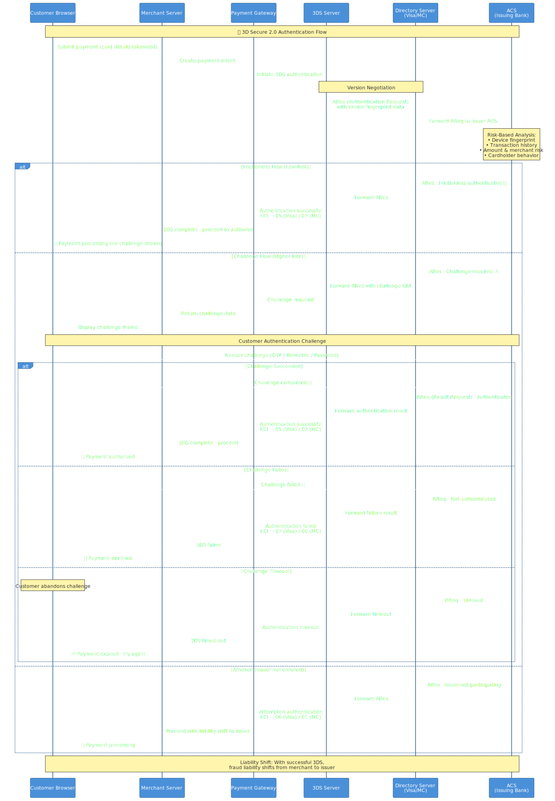

# Payment Flow Diagrams — A Visual Guide

A comprehensive visual reference for understanding how payment flows work. This document uses **Mermaid diagrams rendered as SVG images** and **ASCII flow diagrams** — no code, just flows. Each section explains a different payment scenario with diagrams, step-by-step breakdowns, and key takeaways.

> **How to use this document**: Read it top-to-bottom for a complete education, or jump to a specific flow via the table of contents. Every SVG image has a corresponding `.mmd` source file in the [`diagrams/`](diagrams/) directory that you can edit and re-render.

---

## Table of Contents

1. [Card Payment Authorization Flow](#1-card-payment-authorization-flow)
2. [3D Secure (SCA) Authentication Flow](#2-3d-secure-sca-authentication-flow)
3. [Digital Wallet Payment Flow](#3-digital-wallet-payment-flow)
4. [Bank Transfer (ACH / SEPA) Flow](#4-bank-transfer-ach--sepa-flow)
5. [Buy Now Pay Later (BNPL) Flow](#5-buy-now-pay-later-bnpl-flow)
6. [Refund Processing Flow](#6-refund-processing-flow)
7. [Recurring / Subscription Billing Flow](#7-recurring--subscription-billing-flow)
8. [Payment State Machine](#8-payment-state-machine)
9. [Settlement & Reconciliation Flow](#9-settlement--reconciliation-flow)
10. [Tokenization & Vault Flow](#10-tokenization--vault-flow)
11. [Quick Reference — All Flows at a Glance](#11-quick-reference--all-flows-at-a-glance)
12. [Diagram Source Files](#12-diagram-source-files)

---

## 1. Card Payment Authorization Flow

The most common payment flow globally. Every card transaction — Visa, Mastercard, Amex — follows this lifecycle.



> **Mermaid source:** [`diagrams/card-payment-authorization-flow.mmd`](diagrams/card-payment-authorization-flow.mmd)

### How It Works — Step by Step

```
Step 1: Customer enters card details
        ↓
Step 2: Client-side tokenization (hosted fields / iframe)
        The real card number (PAN) never touches the merchant's server
        ↓
Step 3: Token + amount sent to Payment Gateway (e.g., Stripe, Adyen)
        ↓
Step 4: Gateway validates and forwards to Payment Processor
        ↓
Step 5: Processor routes through the Card Network (Visa, Mastercard, Amex)
        ↓
Step 6: Card Network routes to the Issuing Bank (customer's bank)
        ↓
Step 7: Issuing Bank performs checks:
        ├── Available balance
        ├── Fraud detection rules
        ├── Velocity & spending limits
        └── Card status (active / blocked / expired)
        ↓
Step 8: Issuing Bank returns decision
        ├── ✅ Approved → Authorization code generated
        ├── ⚠️ Soft decline → Temporary issue (retry may succeed)
        └── ❌ Hard decline → Permanent rejection
        ↓
Step 9: Auth code travels back: Issuer → Network → Processor → Gateway → Merchant
        ↓
Step 10: Authorization hold placed on customer's card
         (Funds reserved, not yet transferred)
         ↓
Step 11: Capture (immediate or delayed up to 7 days)
         ↓
Step 12: Batch settlement at end of day
         ↓
Step 13: Acquirer submits to card network → settles with issuer
         ↓
Step 14: Interchange fees deducted → net amount to acquirer
         ↓
Step 15: 💰 Merchant receives payout (T+1 to T+3 business days)
```

### Key Participants

```
┌──────────┐    ┌──────────┐    ┌───────────┐    ┌───────────┐    ┌──────────┐    ┌──────────┐
│ Customer │───▶│ Merchant │───▶│  Payment  │───▶│  Payment  │───▶│   Card   │───▶│ Issuing  │
│          │    │          │    │  Gateway  │    │ Processor │    │ Network  │    │   Bank   │
└──────────┘    └──────────┘    └───────────┘    └───────────┘    └──────────┘    └──────────┘
                      │                                                              │
                      │                         ┌──────────┐                         │
                      └────────────────────────▶│ Acquiring│◀────────────────────────┘
                           Payout (T+1 to T+3)  │   Bank   │       Settlement
                                                └──────────┘
```

### Key Takeaways

| Concept | Detail |
|---------|--------|
| **Authorization ≠ Capture** | Authorization reserves funds; capture actually transfers them |
| **Soft vs Hard decline** | Soft declines (insufficient funds, network timeout) may succeed on retry; hard declines (stolen card, invalid number) will not |
| **Auth hold expiry** | Uncaptured authorizations expire in 7–30 days depending on card network |
| **Settlement** | Happens in batches, typically end-of-day; merchant gets funds T+1 to T+3 |
| **Interchange** | Fee paid by acquirer to issuer; varies by card type, region, and merchant category |

---

## 2. 3D Secure (SCA) Authentication Flow

3D Secure 2.0 adds an authentication layer between the merchant and issuing bank. Required by **PSD2/SCA** in Europe and increasingly adopted globally.



> **Mermaid source:** [`diagrams/3ds-authentication-flow.mmd`](diagrams/3ds-authentication-flow.mmd)

### How It Works — Step by Step

```
Step 1: Customer submits payment on merchant site
        ↓
Step 2: Merchant's payment gateway initiates 3DS
        ↓
Step 3: 3DS Server sends Authentication Request (AReq)
        to Directory Server (Visa / Mastercard)
        ↓
Step 4: Directory Server forwards to Issuer's ACS
        (Access Control Server)
        ↓
Step 5: ACS performs risk-based analysis:
        ├── Device fingerprint
        ├── Transaction history
        ├── Amount & merchant risk category
        └── Cardholder behavior patterns
        ↓
        ┌─────────────────────────────────────────────┐
        │           THREE POSSIBLE PATHS              │
        ├─────────────────────────────────────────────┤
        │                                             │
        │  PATH A: Frictionless (low risk)            │
        │  ✅ ACS authenticates silently              │
        │  Customer sees nothing                      │
        │  ECI = 05 (Visa) / 02 (Mastercard)          │
        │                                             │
        │  PATH B: Challenge (higher risk)            │
        │  ⚠️ Customer sees authentication prompt     │
        │  OTP via SMS, biometric, or password        │
        │  If passed: ECI = 05 / 02                   │
        │  If failed: ECI = 07 / 00 → decline         │
        │                                             │
        │  PATH C: Attempt (issuer not enrolled)      │
        │  Issuer doesn't support 3DS                 │
        │  ECI = 06 (Visa) / 01 (Mastercard)          │
        │  Liability still shifts to issuer           │
        └─────────────────────────────────────────────┘
        ↓
Step 6: Authentication result returned to payment gateway
        ↓
Step 7: Gateway proceeds with authorization (or declines)
```

### ECI (Electronic Commerce Indicator) Values

```
┌──────────────────────────────────────────────────────┐
│                  ECI Values                          │
├──────────┬───────────┬───────────────────────────────┤
│  Visa    │ Mastercard│ Meaning                       │
├──────────┼───────────┼───────────────────────────────┤
│   05     │    02     │ Fully authenticated            │
│          │           │ Liability → Issuer             │
├──────────┼───────────┼───────────────────────────────┤
│   06     │    01     │ Attempted (issuer not enrolled)│
│          │           │ Liability → Issuer             │
├──────────┼───────────┼───────────────────────────────┤
│   07     │    00     │ Not authenticated              │
│          │           │ Liability → Merchant           │
└──────────┴───────────┴───────────────────────────────┘
```

### Key Takeaways

| Concept | Detail |
|---------|--------|
| **Liability shift** | Successful 3DS shifts fraud liability from merchant to issuer |
| **Frictionless ≈ 85%** | Most 3DS 2.0 transactions are frictionless (no customer interaction) |
| **SCA mandate** | EU PSD2 requires Strong Customer Authentication for most online payments |
| **Exemptions** | Low-value (<€30), low-risk, recurring, and merchant-initiated transactions can be exempt |

---

## 3. Digital Wallet Payment Flow

Apple Pay, Google Pay, and Samsung Pay use **device-level tokenization** so the real card number never leaves the customer's device.



> **Mermaid source:** [`diagrams/digital-wallet-payment-flow.mmd`](diagrams/digital-wallet-payment-flow.mmd)

### How It Works — Step by Step

```
Step 1: Customer taps "Pay with Apple Pay / Google Pay"
        ↓
Step 2: Device authenticates customer
        ├── Face ID / Touch ID (Apple)
        ├── Fingerprint / PIN / Face (Google)
        └── Biometric confirmation required
        ↓
Step 3: Secure Element on device creates encrypted payment token
        ├── DPAN (Device Primary Account Number) used instead of real PAN
        ├── Cryptogram generated for this specific transaction
        └── 🔒 Real card number (FPAN) never leaves the device
        ↓
Step 4: Encrypted token sent to merchant
        ↓
Step 5: Merchant forwards token to payment gateway
        ↓
Step 6: Gateway sends to card network's Token Service Provider (TSP)
        ↓
Step 7: TSP maps DPAN → FPAN (the real card number)
        ↓
Step 8: Standard authorization with issuing bank (using FPAN)
        ↓
Step 9: Approval/decline returned through chain
        ↓
Step 10: ✅ Payment confirmed to customer on device
```

### Token Architecture

```
┌─────────────────────────────────────────────────────┐
│                  Customer's Device                  │
│                                                     │
│  ┌──────────────────┐   ┌────────────────────────┐  │
│  │  Wallet App      │   │   Secure Element (SE)  │  │
│  │  (Apple/Google)  │──▶│   - Stores DPAN        │  │
│  │                  │   │   - Generates cryptogram│  │
│  └──────────────────┘   │   - FPAN never exposed  │  │
│                         └────────────────────────┘  │
└──────────────────────────────┬──────────────────────┘
                               │ Encrypted token (DPAN + cryptogram)
                               ▼
┌─────────────────────────────────────────────────────┐
│               Card Network TSP                      │
│         (Token Service Provider)                    │
│                                                     │
│  DPAN → FPAN mapping    One-time cryptogram check   │
│  4000 0012 3456 7890 → 4242 4242 4242 4242          │
└──────────────────────────────────────────────────────┘
```

### Key Takeaways

| Concept | Detail |
|---------|--------|
| **DPAN vs FPAN** | Device PAN is a substitute number; Funding PAN is the real card number |
| **Higher approval rates** | Wallet payments see 2–5% higher approval vs manual card entry |
| **No PCI burden** | Merchant never handles real card data |
| **Cryptogram** | One-time use; prevents token replay attacks |

---

## 4. Bank Transfer (ACH / SEPA) Flow

Bank-to-bank transfers without card networks. **ACH** (US), **SEPA** (EU), **Faster Payments** (UK), **BECS** (AU).



> **Mermaid source:** [`diagrams/bank-transfer-ach-sepa-flow.mmd`](diagrams/bank-transfer-ach-sepa-flow.mmd)

### How It Works — ACH (US)

```
Step 1: Customer authorizes debit (bank account + routing number)
        ↓
Step 2: Merchant initiates ACH debit via their bank (ODFI)
        ODFI = Originating Depository Financial Institution
        ↓
Step 3: ODFI submits entry to ACH Operator
        (Federal Reserve or EPN/The Clearing House)
        ↓
Step 4: ACH Operator routes to customer's bank (RDFI)
        RDFI = Receiving Depository Financial Institution
        ↓
Step 5: RDFI debits customer's account
        ↓
Step 6: Settlement: T+1 (same-day ACH) or T+2 (standard)
        ↓
Step 7: ⚠️ Return window: Up to 60 days for unauthorized debits

Timeline:
┌──────┬──────────────────────────────────────────────┐
│ Day  │ Event                                        │
├──────┼──────────────────────────────────────────────┤
│  0   │ Merchant submits ACH debit                   │
│  1   │ ACH Operator processes batch                 │
│  2   │ RDFI receives and debits customer account    │
│  2-3 │ Settlement — funds available to merchant     │
│ 2-60 │ ⚠️ Return window (unauthorized/error)        │
└──────┴──────────────────────────────────────────────┘
```

### How It Works — SEPA Direct Debit (EU)

```
Step 1: Customer signs mandate (authorization to debit)
        ↓
Step 2: Merchant submits collection to their bank with mandate reference
        ↓
Step 3: Bank submits to SEPA clearing (EBA STEP2 / TARGET2)
        ↓
Step 4: Customer's bank debits account
        ↓
Step 5: Settlement: D+1 (SEPA Instant) or D+2 (Core)
        ↓
Step 6: ⚠️ Refund rights: 8 weeks unconditional, 13 months if no mandate
```

### ACH vs SEPA Comparison

```
┌──────────────────┬──────────────────────┬─────────────────────┐
│                  │ ACH (US)             │ SEPA (EU)           │
├──────────────────┼──────────────────────┼─────────────────────┤
│ Settlement       │ T+1 (same-day)       │ D+1 (Instant)       │
│                  │ T+2 (standard)       │ D+2 (Core)          │
├──────────────────┼──────────────────────┼─────────────────────┤
│ Return window    │ 2 days (errors)      │ 8 weeks             │
│                  │ 60 days (unauth.)    │ (unconditional)     │
├──────────────────┼──────────────────────┼─────────────────────┤
│ Authorization    │ Account + routing #  │ Mandate signed by   │
│                  │                      │ customer (IBAN)     │
├──────────────────┼──────────────────────┼─────────────────────┤
│ Cost             │ $0.20 - $1.50        │ €0.20 - €0.50       │
│                  │ per transaction      │ per transaction     │
├──────────────────┼──────────────────────┼─────────────────────┤
│ Coverage         │ US banks only        │ 36 countries (EU +  │
│                  │                      │ EEA + others)       │
└──────────────────┴──────────────────────┴─────────────────────┘
```

### Key Takeaways

| Concept | Detail |
|---------|--------|
| **Pull vs Push** | Direct debits are "pull" (merchant pulls from customer); wires are "push" (customer pushes) |
| **No instant confirmation** | Unlike cards, you don't know instantly if funds are available |
| **Return risk** | Transactions can be reversed days or weeks later |
| **Best for** | Recurring payments, B2B, high-value transactions where card fees are prohibitive |

---

## 5. Buy Now Pay Later (BNPL) Flow

BNPL providers (Klarna, Afterpay, Affirm, Zip) let customers split purchases into installments while merchants get paid upfront.



> **Mermaid source:** [`diagrams/bnpl-payment-flow.mmd`](diagrams/bnpl-payment-flow.mmd)

### How It Works — Step by Step

```
Step 1: Customer selects "Pay with Klarna / Afterpay / Affirm"
        ↓
Step 2: Merchant creates BNPL session via provider API
        ↓
Step 3: Customer redirected to BNPL provider
        ↓
Step 4: BNPL provider performs eligibility check:
        ├── Soft credit pull (no impact on credit score)
        ├── Purchase history with provider
        ├── Amount within limits ($35–$1,000 typical)
        └── Address verification
        ↓
        ┌──────────────────────────────┐
        │  Approved?                   │
        ├──────────────────────────────┤
        │  ✅ YES → Show payment plan  │
        │  ❌ NO  → Suggest alt method │
        └──────────────────────────────┘
        ↓ (if approved)
Step 5: Customer sees installment plan:
        Example ($100 purchase):
        ├── Payment 1: $25.00 today
        ├── Payment 2: $25.00 in 2 weeks
        ├── Payment 3: $25.00 in 4 weeks
        └── Payment 4: $25.00 in 6 weeks
        (0% interest for "Pay in 4" plans)
        ↓
Step 6: Customer accepts plan
        ↓
Step 7: BNPL provider pays merchant in FULL (minus fee)
        Merchant receives ~$96 (after ~3-6% BNPL merchant fee)
        ↓
Step 8: Customer pays installments directly to BNPL provider
        Provider handles collections, reminders, late fees
```

### Three-Party Relationship

```
┌──────────────┐                ┌──────────────────┐
│   Customer   │                │     Merchant     │
│              │   purchases    │                  │
│  Pays over   │───────────────▶│  Gets paid in    │
│  4-12 weeks  │    goods       │  full upfront    │
│  to provider │                │  (minus fee)     │
└──────┬───────┘                └────────┬─────────┘
       │                                 │
       │ installment payments            │ full amount - fee
       ▼                                 ▼
       ┌─────────────────────────────────┐
       │        BNPL Provider            │
       │   (Klarna / Afterpay / Affirm)  │
       │                                 │
       │  • Assumes credit risk          │
       │  • Handles collections          │
       │  • Charges merchant 3-6%        │
       │  • May charge late fees         │
       └─────────────────────────────────┘
```

### Key Takeaways

| Concept | Detail |
|---------|--------|
| **Merchant gets paid upfront** | BNPL provider takes on the installment risk |
| **Merchant fee** | 3–6% (higher than card processing fees of ~2.5%) |
| **Customer appeal** | 0% interest on short-term plans; higher conversion at checkout |
| **Regulatory trend** | Increasing regulation worldwide (UK, EU, Australia) |

---

## 6. Refund Processing Flow

Refunds reverse a completed payment. The flow differs depending on *when* the refund is initiated relative to the original transaction.



> **Mermaid source:** [`diagrams/refund-processing-flow.mmd`](diagrams/refund-processing-flow.mmd)

### Three Types of Reversal

```
┌───────────────────────────────────────────────────────────────────┐
│                                                                   │
│   VOID                  REFUND                 CHARGEBACK         │
│   (pre-capture)         (post-settlement)      (customer-initiated)│
│                                                                   │
│   ┌─────────────┐      ┌─────────────┐      ┌─────────────┐      │
│   │ Auth placed  │      │ Funds       │      │ Customer    │      │
│   │ but NOT yet  │      │ already     │      │ disputes    │      │
│   │ captured     │      │ settled to  │      │ charge with │      │
│   │              │      │ merchant    │      │ their bank  │      │
│   ├─────────────┤      ├─────────────┤      ├─────────────┤      │
│   │ Cost: FREE   │      │ Cost: ~$0.25│      │ Cost: $15-  │      │
│   │ Speed: instant│     │ per refund  │      │ $100 fee    │      │
│   │ Best option  │      │ 5-10 days   │      │ + revenue   │      │
│   │ if possible  │      │ to customer │      │ loss risk   │      │
│   └─────────────┘      └─────────────┘      └─────────────┘      │
│                                                                   │
│   Timeline:                                                       │
│   ─────────────────────────────────────────────────▶              │
│   │                │               │              │               │
│   Auth             Capture         Settlement     Dispute         │
│   (void here)      (void window    (refund here)  (chargeback)    │
│                     closes)                                       │
└───────────────────────────────────────────────────────────────────┘
```

### Refund Step by Step

```
Step 1: Merchant receives refund request
        ↓
Step 2: Validate eligibility:
        ├── Within refund window? (typically 60-180 days)
        ├── Order status allows refund?
        ├── Amount ≤ original captured amount?
        └── No duplicate refund in progress?
        ↓
Step 3: Full or partial refund?
        ├── Full: Return entire captured amount
        └── Partial: Return specific amount (e.g., one item)
        ↓
Step 4: Submit refund to payment provider
        ↓
Step 5: Provider processes reversal through card network
        ↓
Step 6: Issuing bank credits customer's account
        (3–10 business days for customer to see funds)
        ↓
Step 7: Merchant reconciles: refund deducted from next payout
        ↓
Step 8: ⚠️ Note: Original interchange fees are NOT refunded to merchant
```

### Key Takeaways

| Concept | Detail |
|---------|--------|
| **Void > Refund** | Always void before capture if possible — it's free and instant |
| **Fees not returned** | Original processing + interchange fees are lost on refund |
| **Prevent chargebacks** | Proactive refunds prevent costly chargeback disputes |
| **Partial refunds** | Most providers support multiple partial refunds up to original amount |

---

## 7. Recurring / Subscription Billing Flow

Automated billing that charges customers on a schedule using stored payment methods.



> **Mermaid source:** [`diagrams/recurring-subscription-billing-flow.mmd`](diagrams/recurring-subscription-billing-flow.mmd)

### How It Works — Step by Step

```
Step 1: Customer subscribes → payment method tokenized and stored
        ↓
Step 2: Billing cycle triggers (monthly, annually, etc.)
        ↓
Step 3: System creates invoice and attempts charge
        ↓
Step 4: Charge attempt on stored payment method
        ↓
        ┌──────────────────────────────────────────┐
        │ Result?                                  │
        ├──────────────────────────────────────────┤
        │ ✅ SUCCESS → Invoice paid, continue sub  │
        │ ❌ FAILURE → Enter dunning (retry) flow  │
        └──────────────────────────────────────────┘
        ↓ (if failed)
Step 5: Smart retry schedule:
        ┌──────┬───────────────────────────────────┐
        │ Day  │ Action                            │
        ├──────┼───────────────────────────────────┤
        │  0   │ Initial charge fails              │
        │  1   │ Retry #1 (different time of day)  │
        │  3   │ Retry #2 + email: "update card"   │
        │  5   │ Retry #3 + in-app notification    │
        │  7   │ Retry #4 (final attempt)          │
        │  7   │ ⚠️ Grace period ends              │
        │  14  │ ❌ Subscription cancelled           │
        │      │   (involuntary churn)             │
        └──────┴───────────────────────────────────┘
        ↓
Step 6: If payment recovered → subscription stays active
        If all retries fail → subscription cancelled (involuntary churn)
```

### Proration on Plan Changes

```
Scenario: Customer upgrades mid-cycle from $10/mo to $20/mo on Day 15 of 30

┌───────────────────────────────────────────────────────────┐
│ Day 1              Day 15              Day 30             │
│  │─── $10 plan ────│─── $20 plan ──────│                  │
│                    │                                      │
│  Already paid:     $10.00                                 │
│  Used (15 days):   $10 × 15/30 = $5.00                   │
│  Credit:           $10.00 - $5.00 = $5.00                 │
│  Remaining (15d):  $20 × 15/30 = $10.00                  │
│  Charge now:       $10.00 - $5.00 = $5.00 (prorated)     │
│  Next full cycle:  $20.00                                 │
└───────────────────────────────────────────────────────────┘
```

### Key Takeaways

| Concept | Detail |
|---------|--------|
| **Smart retries** | Retry at different times of day; some cards decline at month-end but succeed on the 1st |
| **Dunning emails** | 3–4 email sequence is standard; include direct "update payment" link |
| **Involuntary churn** | 20–40% of subscription churn is due to failed payments, not cancellations |
| **Account updater** | Services that auto-update expired/reissued cards can recover 5–10% of failures |

---

## 8. Payment State Machine

Every payment transitions through defined states. This state machine shows **all possible states and transitions**.



> **Mermaid source:** [`diagrams/payment-state-machine.mmd`](diagrams/payment-state-machine.mmd)

### All Payment States

```
┌────────────────────────────────────────────────────────────────────────┐
│                    PAYMENT STATE MACHINE                              │
├────────────────┬───────────────────────────────────────────────────────┤
│ State          │ Description                                         │
├────────────────┼───────────────────────────────────────────────────────┤
│ Created        │ Payment intent initialized; waiting for customer     │
│ Pending        │ Customer submitted payment; processing              │
│ RequiresAction │ Awaiting 3DS challenge or redirect confirmation      │
│ Authorized     │ Funds reserved on card; not yet captured            │
│ Captured       │ Capture submitted; awaiting settlement              │
│ PartiallyCaptured │ Less than auth amount captured                   │
│ Settled        │ Funds transferred to merchant; payment complete     │
│ Refunded       │ Full amount returned to customer                    │
│ PartiallyRefunded │ Some amount returned; rest retained              │
│ Disputed       │ Customer filed chargeback; funds provisionally held │
│ DisputeWon     │ Merchant won dispute; funds being returned          │
│ DisputeLost    │ Merchant lost dispute; funds go to customer         │
│ Voided         │ Authorization cancelled before capture (free)       │
│ Expired        │ Session or authorization timed out                  │
│ Cancelled      │ Customer abandoned before submission                │
│ Failed         │ Authorization declined by issuer                    │
└────────────────┴───────────────────────────────────────────────────────┘
```

### Valid Transitions

```
Created ──────────▶ Pending ──────────▶ Authorized ──────────▶ Captured
   │                   │                    │                     │
   ├──▶ Expired        ├──▶ RequiresAction  ├──▶ Voided           │
   └──▶ Cancelled      ├──▶ Failed          ├──▶ Expired          ▼
                       │                    └──▶ PartiallyCaptured
                       ▼                               │        Settled
                  RequiresAction                       ▼           │
                       │                           Settled         │
                       ├──▶ Authorized                │           │
                       ├──▶ Failed                    ├──▶ Refunded
                       └──▶ Expired                   ├──▶ PartiallyRefunded
                                                      └──▶ Disputed
                                                              │
                                                              ├──▶ DisputeWon → Settled
                                                              ├──▶ DisputeLost → Refunded
                                                              └──▶ Refunded (merchant accepts)
```

### Terminal States (No Further Transitions)

```
❌ Failed        — Authorization declined
⏰ Expired       — Timed out
🚫 Cancelled     — Abandoned by customer
↩️  Voided        — Cancelled before capture
💰 Refunded      — Fully returned to customer
```

### Key Takeaways

| Concept | Detail |
|---------|--------|
| **Idempotency** | State transitions must be idempotent — processing the same webhook twice must not create duplicate transitions |
| **Terminal states** | 5 terminal states where no further action is possible |
| **Dispute window** | Customers can dispute settled payments for 120+ days (varies by network) |
| **Void vs Refund** | Voiding is free and instant; always prefer void if payment hasn't been captured |

---

## 9. Settlement & Reconciliation Flow

How money actually moves from customer to merchant at the end of each day, and how fees are calculated.



> **Mermaid source:** [`diagrams/settlement-reconciliation-flow.mmd`](diagrams/settlement-reconciliation-flow.mmd)

### How It Works — Step by Step

```
Step 1: End of business day — Merchant's batch closes
        All captured transactions grouped into a settlement batch
        ↓
Step 2: Acquiring bank collects the batch
        ↓
Step 3: Acquirer submits batch to card networks (Visa, MC, Amex)
        ↓
Step 4: Card networks route each transaction to the issuing bank
        ↓
Step 5: Issuing banks transfer funds (minus interchange fee)
        ↓
Step 6: Card network deducts network assessment fee
        ↓
Step 7: Acquirer receives net amount
        ↓
Step 8: Acquirer deducts processor markup (acquirer fee)
        ↓
Step 9: 💰 Merchant receives payout
        Payout = Gross sales - (Interchange + Assessment + Acquirer fee)
```

### Fee Breakdown (Merchant Discount Rate)

```
┌─────────────────────────────────────────────────────────────────┐
│            Fee Breakdown for a $100 Card Payment                │
├─────────────────────────────────────────────────────────────────┤
│                                                                 │
│  $100.00  Gross transaction amount                              │
│                                                                 │
│  - $1.80  Interchange fee (paid to issuing bank)                │
│           Largest component; varies by card type                │
│           Debit: ~0.5-1.0%  |  Credit: ~1.5-2.5%               │
│           Rewards cards: ~2.0-3.0%                              │
│                                                                 │
│  - $0.14  Network assessment fee (paid to Visa/MC)              │
│           ~0.13-0.15% of transaction                            │
│                                                                 │
│  - $0.36  Processor / acquirer markup                           │
│           Varies by processor and plan                          │
│           Flat rate (Stripe 2.9%+$0.30) includes all above      │
│                                                                 │
│  ────────────────────────────────────────                       │
│  = $97.70  Net amount to merchant                               │
│            (Effective rate: ~2.30%)                              │
│                                                                 │
│  ⚠️ Flat-rate processors (Stripe, Square) simplify billing      │
│     but may cost more for low-risk merchants with high volume   │
└─────────────────────────────────────────────────────────────────┘
```

### Key Takeaways

| Concept | Detail |
|---------|--------|
| **Interchange** | Largest fee component; set by card networks, non-negotiable |
| **Flat-rate vs Interchange++** | Flat rate (Stripe 2.9%+$0.30) is simple; Interchange++ is cheaper at scale |
| **Settlement timing** | T+1 (next business day) to T+3 depending on processor and bank |
| **Reconciliation** | Match settlement reports against orders daily to catch discrepancies |

---

## 10. Tokenization & Vault Flow

How payment providers protect card data through tokenization, reducing the merchant's PCI compliance burden.



> **Mermaid source:** [`diagrams/tokenization-vault-flow.mmd`](diagrams/tokenization-vault-flow.mmd)

### How It Works — Step by Step

```
Step 1: Customer enters card number in a PCI-compliant form
        (Hosted fields, iframe, or mobile SDK — NOT merchant's own form)
        ↓
Step 2: Card data sent DIRECTLY to payment provider's vault
        🔒 The card number NEVER touches the merchant's server
        ↓
Step 3: Vault encrypts PAN with AES-256 using HSM
        (Hardware Security Module — tamper-resistant crypto processor)
        ↓
Step 4: Vault creates mapping: opaque token ←→ encrypted PAN
        e.g., tok_1MwFcK2eZvKYlo → encrypted(4242424242424242)
        ↓
Step 5: Token returned to merchant's frontend → stored in merchant DB
        (Token is NOT PCI-sensitive — safe to store anywhere)
        ↓
Step 6: For future charges, merchant sends token to provider
        ↓
Step 7: Vault decrypts PAN using token → sends to processor
        ↓
Step 8: Standard authorization with real card number
```

### Gateway vs Network Tokenization

```
┌────────────────────────────────┬───────────────────────────────────┐
│   Gateway Tokenization         │   Network Tokenization (DPAN)    │
├────────────────────────────────┼───────────────────────────────────┤
│ Token created by payment       │ Token issued by card network     │
│ gateway (Stripe, Adyen)        │ (Visa, Mastercard)               │
├────────────────────────────────┼───────────────────────────────────┤
│ Token works ONLY with          │ Token works across ANY           │
│ that specific gateway          │ payment provider                 │
├────────────────────────────────┼───────────────────────────────────┤
│ Merchant locked to one         │ Portable — switch providers      │
│ provider (vendor lock-in)      │ without re-collecting cards      │
├────────────────────────────────┼───────────────────────────────────┤
│ Simple to implement            │ More complex setup               │
│ Most common approach           │ Requires network enrollment      │
├────────────────────────────────┼───────────────────────────────────┤
│ Standard approval rates        │ +2-5% higher approval rates      │
│                                │ (networks trust their own tokens)│
├────────────────────────────────┼───────────────────────────────────┤
│ Manual card updates needed     │ Auto-updates on card reissue     │
│ when cards expire              │ (Account Updater built-in)       │
└────────────────────────────────┴───────────────────────────────────┘
```

### PCI Scope Reduction

```
Without tokenization:                 With tokenization:
┌──────────────────────────────┐     ┌──────────────────────────────┐
│ Full PCI DSS Compliance      │     │ PCI SAQ-A or SAQ-A-EP        │
│ ~300+ requirements           │     │ ~22 requirements             │
│ Annual on-site audit (L1)    │     │ Self-assessment questionnaire│
│ Quarterly vulnerability scan │     │ Minimal infrastructure scope │
│ Network segmentation         │     │ No card data in your systems │
│ $50K–$200K+ annual cost      │     │ $5K–$20K annual cost         │
└──────────────────────────────┘     └──────────────────────────────┘
```

### Key Takeaways

| Concept | Detail |
|---------|--------|
| **Never build your own vault** | Use provider-hosted fields; building your own requires full PCI L1 compliance |
| **Network tokens** | Higher approval rates, auto-updates, provider portability — worth the setup effort for scale |
| **HSM** | Hardware Security Module physically protects encryption keys; required for PCI compliance |
| **Token lifecycle** | Tokens auto-update when cards are reissued; invalidate when cards are cancelled |

---

## 11. Quick Reference — All Flows at a Glance

```
┌──────────────────────────────────────────────────────────────────────────────────┐
│                        PAYMENT FLOW COMPARISON                                  │
├───────────────────┬──────────────┬──────────────┬──────────────┬────────────────┤
│ Flow              │ Speed        │ Cost         │ Confirmation │ Reversal Risk  │
├───────────────────┼──────────────┼──────────────┼──────────────┼────────────────┤
│ Card Payment      │ Instant auth │ 1.5–3.5%     │ Immediate    │ Chargeback     │
│                   │ T+1–3 settle │ + $0.10–0.30 │              │ (120+ days)    │
├───────────────────┼──────────────┼──────────────┼──────────────┼────────────────┤
│ Digital Wallet    │ Instant auth │ Same as card │ Immediate    │ Same as card   │
│ (Apple/Google)    │ T+1–3 settle │ (or lower)   │              │                │
├───────────────────┼──────────────┼──────────────┼──────────────┼────────────────┤
│ ACH (US)          │ T+1 to T+2  │ $0.20–1.50   │ Delayed      │ Returns up to  │
│                   │              │ flat fee     │ (1–2 days)   │ 60 days        │
├───────────────────┼──────────────┼──────────────┼──────────────┼────────────────┤
│ SEPA (EU)         │ D+1 to D+2  │ €0.20–0.50   │ Delayed      │ 8 weeks uncon. │
│                   │              │ flat fee     │ (1–2 days)   │ 13 months auth │
├───────────────────┼──────────────┼──────────────┼──────────────┼────────────────┤
│ BNPL              │ Instant for  │ 3–6%         │ Immediate    │ Provider absorbs│
│ (Klarna, etc.)    │ merchant     │              │ (for merch.) │ credit risk    │
├───────────────────┼──────────────┼──────────────┼──────────────┼────────────────┤
│ Recurring/Sub     │ Automated    │ Same as card │ Immediate    │ Dunning +      │
│                   │ per cycle    │              │ (per charge) │ churn risk     │
└───────────────────┴──────────────┴──────────────┴──────────────┴────────────────┘
```

### When to Use Which

```
Card payment      →  Default for most online purchases
Digital wallet    →  Mobile-first, higher conversion, lower friction
ACH / SEPA        →  Recurring B2B, high-value, lower fees
BNPL              →  Higher AOV ($100+), fashion/retail, younger demographics
Recurring billing →  SaaS, subscriptions, memberships
```

---

## 12. Diagram Source Files

All diagrams in this document are rendered from Mermaid source files. You can edit and re-render them.

| Diagram | Source File | SVG |
|---------|------------|-----|
| Card Payment Authorization | [`card-payment-authorization-flow.mmd`](diagrams/card-payment-authorization-flow.mmd) | [`card-payment-authorization-flow.svg`](diagrams/card-payment-authorization-flow.svg) |
| 3D Secure Authentication | [`3ds-authentication-flow.mmd`](diagrams/3ds-authentication-flow.mmd) | [`3ds-authentication-flow.svg`](diagrams/3ds-authentication-flow.svg) |
| Digital Wallet Payment | [`digital-wallet-payment-flow.mmd`](diagrams/digital-wallet-payment-flow.mmd) | [`digital-wallet-payment-flow.svg`](diagrams/digital-wallet-payment-flow.svg) |
| Bank Transfer (ACH/SEPA) | [`bank-transfer-ach-sepa-flow.mmd`](diagrams/bank-transfer-ach-sepa-flow.mmd) | [`bank-transfer-ach-sepa-flow.svg`](diagrams/bank-transfer-ach-sepa-flow.svg) |
| Buy Now Pay Later | [`bnpl-payment-flow.mmd`](diagrams/bnpl-payment-flow.mmd) | [`bnpl-payment-flow.svg`](diagrams/bnpl-payment-flow.svg) |
| Refund Processing | [`refund-processing-flow.mmd`](diagrams/refund-processing-flow.mmd) | [`refund-processing-flow.svg`](diagrams/refund-processing-flow.svg) |
| Recurring Subscription Billing | [`recurring-subscription-billing-flow.mmd`](diagrams/recurring-subscription-billing-flow.mmd) | [`recurring-subscription-billing-flow.svg`](diagrams/recurring-subscription-billing-flow.svg) |
| Payment State Machine | [`payment-state-machine.mmd`](diagrams/payment-state-machine.mmd) | [`payment-state-machine.svg`](diagrams/payment-state-machine.svg) |
| Settlement & Reconciliation | [`settlement-reconciliation-flow.mmd`](diagrams/settlement-reconciliation-flow.mmd) | [`settlement-reconciliation-flow.svg`](diagrams/settlement-reconciliation-flow.svg) |
| Tokenization & Vault | [`tokenization-vault-flow.mmd`](diagrams/tokenization-vault-flow.mmd) | [`tokenization-vault-flow.svg`](diagrams/tokenization-vault-flow.svg) |

### Re-rendering Diagrams

To regenerate SVGs from the Mermaid source files:

```bash
# Install mermaid-cli
npm install -g @mermaid-js/mermaid-cli

# Render a single diagram
mmdc -i diagrams/card-payment-authorization-flow.mmd -o diagrams/card-payment-authorization-flow.svg -b transparent

# Render all diagrams
for f in diagrams/*.mmd; do
    mmdc -i "$f" -o "${f%.mmd}.svg" -b transparent
done
```

---

## Related Documents

| Document | Relevance |
|----------|-----------|
| [00-OVERVIEW](00-OVERVIEW.md) | Payment flow basics and core concepts |
| [04-WEBHOOK-PATTERNS](04-WEBHOOK-PATTERNS.md) | How payment events are delivered asynchronously |
| [15-SECURITY-PATTERNS-PRACTICES](15-SECURITY-PATTERNS-PRACTICES.md) | PCI DSS, encryption, and fraud prevention |
| [24-PAYMENT-METHODS-AND-FLOWS](24-PAYMENT-METHODS-AND-FLOWS.md) | Payment method implementation details |
| [26-REGIONAL-PAYMENT-METHODS](26-REGIONAL-PAYMENT-METHODS.md) | Country-specific payment flows (UPI, Pix, etc.) |
| [27-PAYMENT-PROVIDER-DEEP-DIVE](27-PAYMENT-PROVIDER-DEEP-DIVE.md) | Provider comparison and multi-provider routing |
| [32-RETURNS-REFUNDS-RMA](32-RETURNS-REFUNDS-RMA.md) | Detailed return and refund processing |
